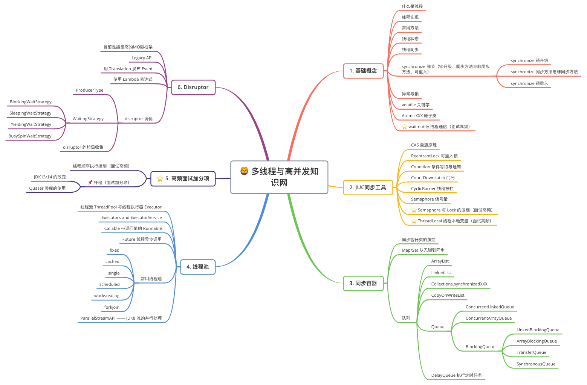

# 🔥 知识星球

> 学习笔记、问题跟踪。。。

* [在线阅读网站 Gitee](https://witty-hamster.gitee.io/galaxy)

## Java

### 基础

- [Java Lambda表达式与Stream流API](docs/java/basis/java-lambda-and-stream.md)
- [Java网络编程](docs/java/basis/java-network-program.md)
- [serialVersionUID 问题](docs/java/basis/serialVersionUID.md)

### 多线程与高并发

- 知识网

  

#### 基础部分

- [🐹 线程的基本概念、常用方法、线程状态](docs/java/concurrent/a-java-thread-basis.md)
- [🐱 Java 线程池](docs/java/concurrent/a-java-thread-pool.md)
- [🐤 Java多线程源码解读](docs/java/concurrent/a-thread-source-code.md)

#### 高级部分

- [🐶 Java线程知识网](docs/java/concurrent/b-java-thread.md)

### 锁 :closed_lock_with_key:

- [Synchronized锁](docs/java/concurrent/b-synchronized.md)

## 💢 问题仓

- [Redis问题](docs/error-pool/redis.md)

## 碎片化知识库

- [IDEA Show Diagrams 功能说明](docs/idea/IDEA-Show-Diagrams.md)

## 工具集

- [Java-时间工具](docs/tools/Java-TimeUtils.md)

## 面试

- [面经](docs/Interview/a-Interview-experience.md)

> ‼️ 警告：如需展示在文档列表的内容，路径一定要是英文的。
