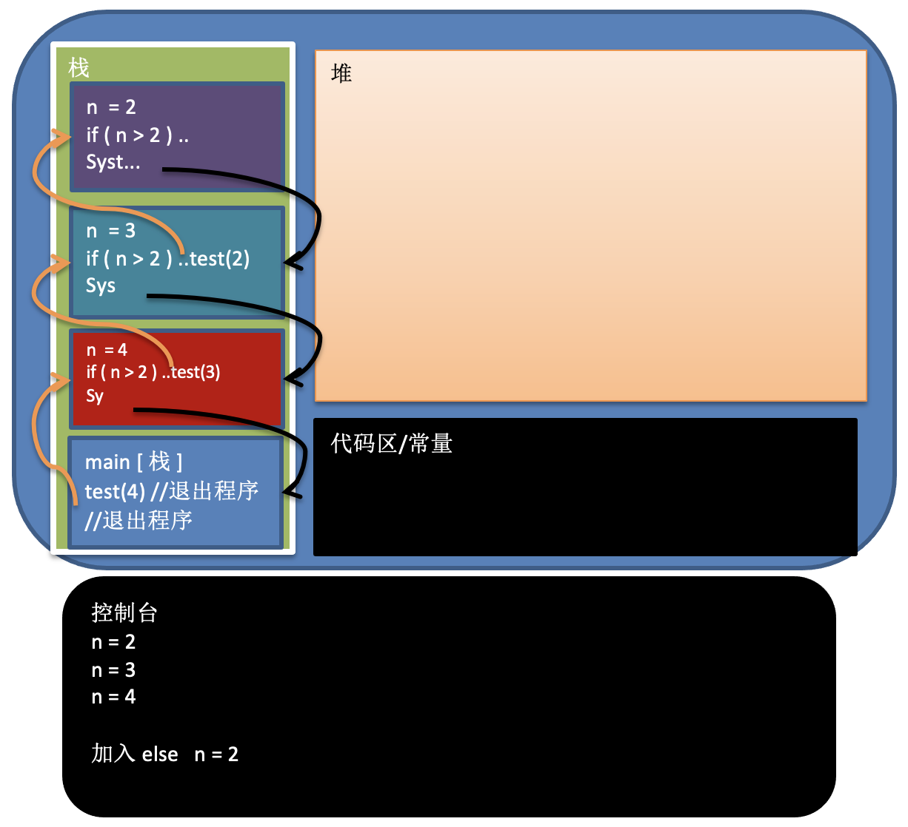

# 【算法】 递归

## 1. 递归的概念

- 简单来说：递归就是方法自己调用自己，每次调用时传入不同的变量
- 优点：有助于编程者解决复杂的问题，同时可以让代码变得简洁

## 2. 递归的调用机制

> 示例：
>
> 	- 打印问题
> 	- 阶乘问题

- 打印问题图解 & 文字描述

  - 代码实现

    ```java
    public class PrintCase {
        public static void main(String[] args) {
            System.out.println("打印方法中没有else条件时，打印结果如下: ");
            print1(4);
            System.out.println("打印方法中有else条件时，打印结果如下: ");
            print2(4);
        }
    
        /**
         * 打印方法，没有else方式
         *  - 观察打印出来的结果是什么样
         */
        public static void print1(int n) {
            if (n > 2) {
                print1(n - 1);
            }
            System.out.println("n = " + n);
        }
    
        /**
         * 打印方法，增加else判断
         *  - 观察打印出来的结果是什么样
         */
        public static void print2(int n) {
            if (n > 2) {
                print2(n - 1);
            } else {
                System.out.println("n = " + n);
            }
        }
    }
    
    ```

  - 分析图解

    

  - 递归调用规则

    1. 当程序执行到一个方法时，就会开辟一个独立的空间（栈）
    2. 每个空间的数据（局部变量）是独立的。

- 阶乘问题

  - 代码实现

    ```java
    public class FactorialCase {
        public static void main(String[] args) {
            int result = factorial(10);
            System.out.println("阶乘结果为 " + result);
        }
    
        /**
         * 阶乘方法
         */
        public static int factorial(int n) {
            if (n == 1) {
                return n;
            } else {
                // n * (n - 1) * (n - 2) * ... * 1
                return n * factorial(n - 1);
            }
        }
    }
    
    ```

## 3. 递归能解决什么问题

- 各种数学问题，如：8皇后问题，汉诺塔，阶乘问题，迷宫问题，球和篮子的问题等
- 各种算法中会使用到递归，比如快排、归并排序、二分查找、分治算法等
- 将用栈解决问题，递归代码比较简洁

## 4. 递归需要遵守的重要规则

- 执行一个方法时，就会创建一个新的受保护的独立空间（栈空间）
- 方法的局部变量是独立的，不会相互影响
- 如果方法中使用的是引用变量（比如，数组），就会共享该引用类型的数据
- 递归必须向退出递归的条件逼近，否则就是无限递归，程序将出现 `StackOverflowError`，死归了
- 当一个方法执行完毕，或遇到 return，就会返回，遵守谁调用，就将结果返回给谁，同时当方法执行完毕或者返回时，该方法也就执行完毕

## 5. 迷宫问题

### 5.1 问题描述

- 根据正确的路径，使小球从起点走到终点位置

### 5.2 代码实现

```java
package recursion;

/**
 * 递归算法 - 迷宫问题
 *  - [问题]：小球走迷宫问题
 *           迷宫地图如下：(1: 表示墙体，不能走；0: 表示可以走的路)
 *              1	1	1	1	1	1	1
 *              1	0	0	0	0	0	1
 *              1	0	0	0	0	0	1          \
 *              1	1	1	0	0	0	1       ====\       起始位置: 小球的起始位置在坐标点为 [1][1] 的位置处
 *              1	0	0	0	0	0	1       ====/       最终位置: 当小球走到了坐标点 [6][5] 位置处，表示小球走出了迷宫
 *              1	0	0	0	0	0	1          /
 *              1	0	0	0	0	0	1
 *              1	1	1	1	1	1	1
 *
 * @author hamster
 * @date 2022/4/25 16:31
 */
public class MazeCase {
    public static void main(String[] args) {
        // 创建一个二维数组，构建迷宫地图
        int[][] map = new int[8][7];
        // 设置迷宫外墙（上下外墙），用 1 表示墙体
        for (int i = 0; i < 7; i++) {
            map[0][i] = 1;
            map[7][i] = 1;
        }
        // 设置迷宫外墙（左右外墙），用 1 表示墙体
        for (int i = 1; i < 7; i++) {
            map[i][0] = 1;
            map[i][6] = 1;
        }
        // 设置路障
        map[3][1] = 1;
        map[3][2] = 1;
        /*
            实现递归回溯拦截处理
            map[1][2] = 1;
            map[2][2] = 1;
        */
        System.out.println("迷宫地图如下:");
        for (int[] row : map) {
            for (int data : row) {
                System.out.printf("%d\t", data);
            }
            System.out.println();
        }

//        setWay(map, 1, 1);
        setWay2(map, 1, 1);
        System.out.println("小球走出迷宫的路径如下:");
        for (int[] row : map) {
            for (int data : row) {
                System.out.printf("%d\t", data);
            }
            System.out.println();
        }
    }

    /**
     * 小球找路方法
     *  - [说明]
     *      1. 形参 map，表示迷宫地图，在小球走迷宫的过程中，需要对地图位置进行调整
     *      2. 形参 row、col，表示小球从地图的哪个位置开始出发，最开始的位置在 (1, 1)
     *      3. 方法递归调用什么时候结束？？？ 如果小球能到 map[6][5] 位置处，则说明小球的通路已经找到了
     *      4. 约定
     *          4.1 当 map[i][j] == 0，表示该点没有走过
     *          4.2 当 map[i][j] == 1，表示这是一堵墙，走不通
     *          4.3 当 map[i][j] == 2，表示这是通路，可以走
     *          4.4 当 map[i][j] == 3，表示该点已经走过，但是走不通
     *      5. 在走迷宫时，需要确定一个策略，从哪个位置走向哪个位置
     *          5.1 假定，给出 `下 -> 右 -> 上 -> 左` 的先后顺序，来走迷宫
     *          5.2 当该点走不通时，需要对该点进行回溯
     *
     * @param map 迷宫地图
     * @param row 行坐标位置
     * @param col 列坐标位置
     */
    public static boolean setWay(int[][] map, int row, int col) {
        // 什么情况下，递归结束？？？
        if (map[6][5] == 2) {
            // 此时表明，已经走出了迷宫，整条通路已经找到了
            return true;
        }
        if (map[row][col] == 0) {
            // 表明该点还没有走过，从该点开始出发
            map[row][col] = 2;
            if (setWay(map, row + 1, col)) {
                // 向下走，如果向下走的位置还是没有走过，表示可以继续向下走
                return true;
            } else if (setWay(map, row, col + 1)) {
                // 如果向下走，走不通了，开始向右走
                return true;
            } else if (setWay(map, row - 1, col)) {
                // 向上走
                return true;
            } else if (setWay(map, row, col - 1)) {
                // 向左走
                return true;
            } else {
                // 根据 `下 -> 右 -> 上 -> 左` 的策略都走了一遍之后，发现还是走不通，表示这个点就不是通路里面的点，后续都不用走了
                // 将点位回溯
                map[row][col] = 3;
                return false;
            }
        } else {
            // 如果这个点不为 0，则可能为 1、2、3，此时这个点是不能再走的
            return false;
        }
    }

    /**
     * 第二种路线策略：上 -> 右 -> 下 -> 左
     */
    public static boolean setWay2(int[][] map, int row, int col) {
        // 递归结束的条件
        if (map[6][5] == 2) {
            return true;
        } else {
            if (map[row][col] == 0) {
                map[row][col] = 2;
                if (setWay2(map, row - 1, col)) {
                    return true;
                } else if (setWay2(map, row, col + 1)) {
                    return true;
                } else if (setWay2(map, row + 1, col)) {
                    return true;
                } else if (setWay2(map, row, col - 1)) {
                    return true;
                } else {
                    map[row][col] = 3;
                    return false;
                }
            } else {
                return false;
            }
        }
    }
}

```

### 5.3 问题深入讨论

- 思考一：小球的路径与什么相关？
  - 小球所走过的路径，与我们程序员所设定的寻路策略有关，比如 `下 → 右 → 上 → 左` 与 `上 → 右 → 下 → 左` 所得到的最终路径是不同的
- 思考二：如何求得小球的最短路径？
  - 最简单的办法：穷举法，将所有可能的路径策略全部测试一遍，得到步数最少的哪一种策略，即为最短路径策略

## 6. 八皇后问题

### 6.1 问题描述

八皇后问题是一个古老而著名的问题，是回溯算法的典型案例。该问题是国际西洋棋棋手马克斯·贝瑟尔于1848年提出：在 8 x 8 格的国际象棋上摆放八个皇后，使其不能互相攻击，即：任意两个皇后都不能处于同一行、同一列或同一斜线上，问共有多少种摆法？

- 经回溯算法计算后，可以得到 92 种摆法

### 6.2 代码实现

```java
package recursion;

/**
 * <h1>递归算法 - 八皇后问题</h1>
 * <h2>问题描述</h2>
 * <p>
 *     八皇后问题是一个古老而著名的问题，是回溯算法的典型案例。
 *     该问题是国际西洋棋棋手马克斯·贝瑟尔于1848年提出：在 8 x 8 格的国际象棋上摆放八个皇后，使其不能互相攻击，
 *     即：<em>任意两个皇后都不能处于同一行、同一列或同一斜线上，问共有多少种摆法？</em>
 * </p>
 * <br/>
 * <h2>解题思路</h2>
 * <ol>
 *     <li>第一个皇后先放到第一行第一列</li>
 *     <li>第二个皇后放在第二行第一列，然后判断第二个皇后的位置是否合适，如果不合适，继续将第二个皇后放到第二列、第三列，依次把所有列都放完，找到一个合适的列</li>
 *     <li>继续第三个皇后，寻找位置的方法与第二个皇后一致，直到第8个皇后也能放在一个不冲突的位置，则算是找到了一个正确的解</li>
 *     <li>当得到一个正确解时，将栈回退到上一个栈时，就会开始回溯。即，将第一个皇后放在第一个列的所有正确解全部得到</li>
 *     <li>然后回头继续第一个皇后放到第二列，后面继续执行1, 2, 3, 4步骤</li>
 * </ol>
 *
 * @author hamster
 * @date 2022/6/14 09:35
 */
public class Queue8Case {

    /** 定义一个max，表示共有多少个皇后 */
    private final int max = 8;
    /**
     * 定义数组array，存储保存皇后放置位置的结果
     * <ul>
     *     <li><b>索引下标 + 1</b>，表示第几个皇后，第几行</li>
     *     <li><b>数组元素 + 1</b>，表示第几列</li>
     * </ul>
     */
    int[] array = new int[max];
    /** 统计共有多少种摆法 */
    static int count = 0;
    /** 统计共计判断了多少次冲突 */
    static int judgeCount = 0;
    public static void main(String[] args) {
        Queue8Case queue8Case = new Queue8Case();
        queue8Case.place(0);
        System.out.printf("共计%d种算法\n", count);
        System.out.printf("共计判定了%d次冲突\n", judgeCount);
    }

    private void place(int n) {
        if (n == max) {
            // 当 n = 8 时，表明8个皇后已经放置好了，并得出了正确的解法
            print();
            return;
        }
        // 依次开始放置皇后
        for (int i = 0; i < max; i++) {
            // 先将当前这个皇后 n，放置在该行的第一列
            array[n] = i;
            // 判断当放置第n个皇后到第i列时，是否冲突
            if (judge(n)) {
                // 如果不冲突，则接着放置第n + 1个皇后。即，开始递归
                place(n + 1);
            }
            // 如果冲突，则继续执行 array[n] = i 操作。即，将第n个皇后，向右移动一列，重新进行判定
        }
    }

    /**
     * 判定当我们放置第n个皇后时，该皇后是否和前面已经摆放的皇后发生冲突
     * @param n 放置的第n个皇后
     * @return true 表示不冲突 | false 表示冲突
     */
    private boolean judge(int n) {
        judgeCount ++;
        for (int i = 0; i < n; i++) {
            /**
             * 校验方式说明
             *  1. array[i] == array[n]，表示判断第n个皇后是否和前面 n - 1 个皇后在同一列
             *  2. Math.abs(n - i) == Math.abs(array[n] - array[i])，表示判断第n个皇后是否和第i个皇后在同一斜线上
             *  3. 无需判断是否在同一行，因为n每次都在递增
             */
            if (array[i] == array[n] || Math.abs(n - i) == Math.abs(array[n] - array[i])) {
                return false;
            }
        }
        return true;
    }

    /**
     * 输出摆法位置
     */
    private void print() {
        count ++;
        for (int site : array) {
            System.out.printf("%d\t", site);
        }
        System.out.println();
    }
}

```

