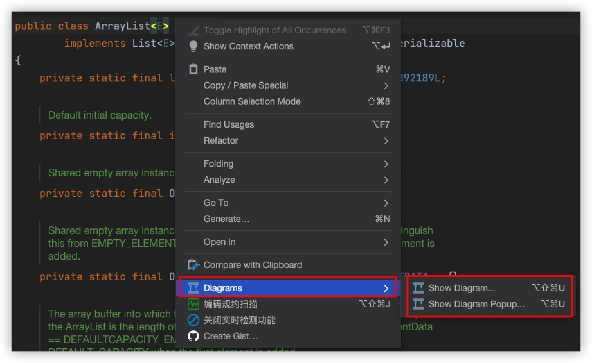
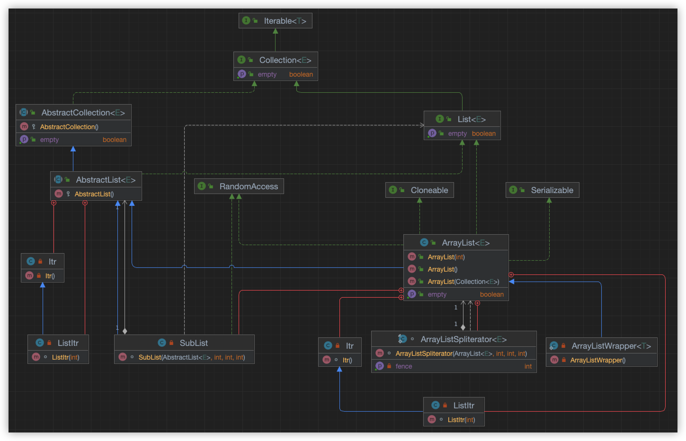
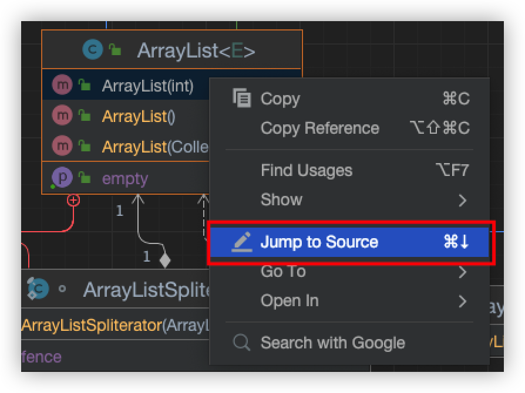
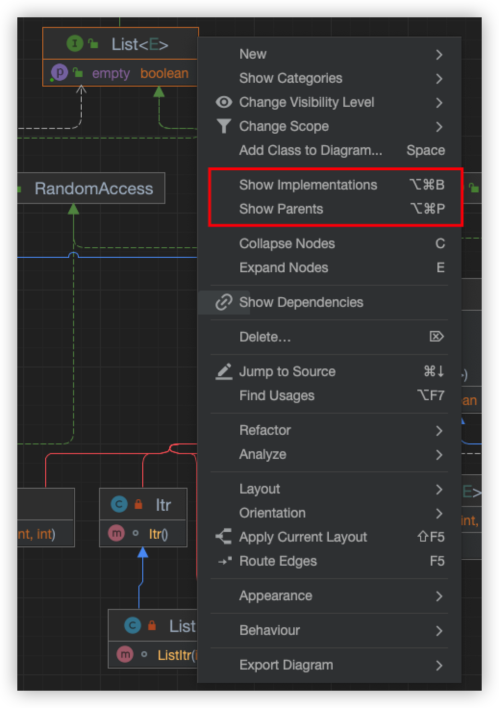
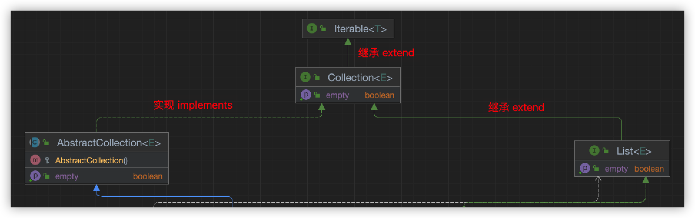

# IDEA Show Diagrams 功能说明

## Diagrams有什么用

- IDEA Diagrams 功能是查看类、接口继承和实现的工具，可提供类、接口之间的依赖关系

## 如何使用

> 注意：社区版IDEA无 show diagrams 功能

- 在想要查看的类或接口上，右键选择 `show diagrams`

  

- `Diagrams` 中两个选项说明
  
  - `Show Diagram` 会以一个新的窗口打开类图解
  - `Show Diagram Pipup...` 则是直接在此处以一个弹窗的形式展示

## 类图解效果展示

- 可以展示的信息包含：结构图、继承、实现、内部实现类、方法、变量、构造方法等

## 功能说明

| num  | 按钮                    | 功能              |
| ---- | ----------------------- | ----------------- |
| 1    | Fields                  | 域                |
| 2    | Constructors            | 构造器            |
| 3    | Method                  | 方法              |
| 4    | Properties              | 属性              |
| 5    | Inner Class             | 内部类            |
| 6    | Change Visibility Level | 更改可见性级别    |
| 7    | Change Scope            | 改变范围          |
| 8    | Edge Creation Mode      | 边缘创建模式      |
| 9    | Show Dependencies       | 显示依赖关系      |
| 10   | Layout & Route          | 自动布局&自动走线 |

## 定位源码位置

## 添加子类、子实现、父类

- 右键：Show Implementations、Show Parents

  

## 类图符号箭头说明

- 实现箭头
  - 含义：继承 extends
- 虚线箭头
  - 含义：实现 implements

## 类图UML中符号说明（仅供参考，可能有误）

### 方框

- 方框：类或接口

- 两层矩形框：代表接口（interface）

  - 第一层：接口名称
  - 第二层：接口方法

- 三层矩形框：代表类（class）

  > 注意前面的符号：
  >
  > - `+` ：表示 public
  > - `-` ：表示 private
  > - `#` ：表示 protected

  - 第一层：类的名称，如果是抽象类，则用斜体显示
  - 第二层：字段和属性
  - 第三层：类的方法

### 连接线

- 继承类（extends）：用实心三角 + 实线表示
- 实现接口（implements）：用实心三角 + 虚线表示
- 关联（Association）：用实线箭头来表示
- 聚合（Aggregation）：用空心的菱形 + 实线箭头来表示

## 参考文档

- [IDEA生成类图各个图标及联系表示](https://blog.csdn.net/hejingfang123/article/details/113523583?spm=1001.2101.3001.6650.1&utm_medium=distribute.pc_relevant.none-task-blog-2%7Edefault%7ECTRLIST%7Edefault-1-113523583-blog-108127218.pc_relevant_aa&depth_1-utm_source=distribute.pc_relevant.none-task-blog-2%7Edefault%7ECTRLIST%7Edefault-1-113523583-blog-108127218.pc_relevant_aa&utm_relevant_index=2)
- [UML类图的几种关系及对应java代码](https://blog.csdn.net/hejingfang123/article/details/111871668)
- [Idea 中 Show Diagram 展示 UML 类图 各种线代表的含义](https://www.freesion.com/article/39071191475/)

