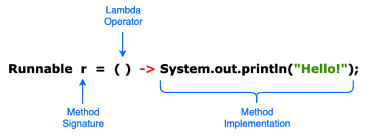

# ⚡️ Java Lambda表达式

## Lambda表达式介绍

​		Lambda表达式是 Java8 中最重要的新功能之一。使用 Lambda表达式可以替代只有一个抽象函数的接口实现，告别匿名内部类，代码看起来更简洁易懂。

​		Lambda表达式同时还提升了对集合、框架的迭代、遍历、过滤数据等操作。

## Lambda表达式特点

1. 函数式编程
2. 参数类型自动推断
3. 代码量少，简洁

## Lambda表达式应用场景

>  **任何有函数式接口的地方**

## 函数式接口

- 只有<b style="color:#ff0000">一个</b>抽象方法（Object类中的方法除外）的接口是函数式接口

### 函数式接口说明

- `Supplier`：代表一个输出
- `Consumer`：代表一个输入
- `BiConsumer`：代表两个输入
- `Function`：代表一个输入、一个输出（一般输入和输出是不同类型的）
- `UnaryOperator`：代表一个输入、一个输出（输入和输出是相同类型的）
- `BiFunction`：代表两个输入，一个输出（一般输入和输出是不同类型的）
- `BinaryOperator`：代表两个输入、一个输出（输入和输出是相同类型的）

### 方法的引用

- 方法引用是用来直接访问类或者实例的已经存在的方法或者构造方法，方法引用提供了一种引用而不执行方法的方式，如果抽象方法的实现恰好可以使用调用另外一个方法来实现，就有可能可以使用方法引用

### 方法引用的分类

| 类型         | 语法               | 对应的Lambda表达式                    |
| ------------ | ------------------ | ------------------------------------- |
| 静态方法引用 | 类名::staticMethod | (args) -> 类名.staticMethod(args)     |
| 实例方法引用 | inst::instMethod   | (args) -> inst.instMethod(args)       |
| 对象方法引用 | 类名::instMethod   | (inst, args) -> 类名.instMethod(args) |
| 构造方法引用 | 类名::new          | (args) -> new 类名(args)              |

- 静态方法引用：如果函数式接口的实现恰好可以通过**调用一个静态方法**来实现，那么就可以使用静态方法引用
- 实例方法引用：如果函数式接口的实现恰好可以通过调用一个实例的实例方法来实现，那么就可以使用实例方法引用
- 对象方法引用：抽象方法的第一个参数类型刚好是实例方法的类型，抽象方法剩余的参数恰好可以当做实例方法的参数。如果函数式接口的实现能由上面说的实例方法调用来实现的话，那么就可以使用对象方法引用
- 构造方法引用：如果函数式接口的实现恰好可以通过调用一个类的构造方法来实现，那么就可以使用构造方法引用

# 🌈 Lambda 表达式的使用

## 为什么使用Lambda表达式

- Lambda表达式可以替代只有一个抽象函数的接口实现，告别匿名内部类，代码看起来更简洁易懂
- Lambda表达式同时还提升了对集合框架的迭代、遍历、过滤数据等操作
- Lambda表达式可以极大的减少代码冗余，同时代码的可读性要好过冗长的内部类，匿名类

## Lambda表达式的语法

- Lambda表达式标准格式：
  - `LambdaParamters -> LambdaBody`
  - `args -> expr` 或者 `(Object... args) -> {函数式接口抽象方法实现逻辑}`
    - `()` 小括号中参数的个数，根据函数式接口里面抽象的参数个数来决定，当参数只有一个的时候，`()`小括号可以省略
    - 当 `expr` 逻辑非常简单的时候，`{}` 大括号和 `return` 可以省略
- 示例，以Runnable接口实现run()方法，说明Lambda的使用方式
  - 

## 表达式的使用案例

> 大多数情况下，我们所使用的Lambda表达式的结构，均可在以下示例中找到对应的形式

- `() -> {}`
- `() -> {System.out.println(1);}`
- `() -> System.out.println(1)`
- `() -> {return 100;}`
- `() -> 100`
- `() -> null`
- `(int x) -> {return x + 1;}`
- `(int x) -> x + 1`
- `(x) -> x + 1`
- `x -> x + 1`

# 🌟 Java Stream API

## Stream 介绍

> A sequence of elements supporting sequential and parallel aggregate operations

Stream 是一组用来处理数组、集合的API。支持顺序和并行聚合操作的元素序列。

- Java 8 之所以引入函数式编程，原因有二：
  - 代码简洁。函数式编程写出的代码简洁且意图明确，使用 Stream 接口让你从此告别 for循环
  - 多核友好。Java函数式编程使得编写并行程序从未如此简单，你需要的全部就是调用一下 parallel() 方法

## Stream 特性

1. 不是数据结构，没有内部存储
2. 不支持索引访问
3. 延迟计算
4. 支持并行
5. 很容易生成数组或集合（List、Set）
6. 支持过滤、查找、转换、汇总、聚合等操作

## Stream 运行机制

- Stream 分为源source，中间操作，终止操作
  - 流的源可以是一个数组、一个集合、一个生成器方法、一个I/O通道等等
  - 一个流可以有零个或者多个中间操作，每个中间操作都会返回一个新的流，供下一个操作使用。一个流只会有一个终止操作
  - Stream 只有遇到终止操作，它的源才开始执行遍历操作

## Stream 的创建

1. 通过数组
2. 通过集合
3. 通过`Stream.generate`方法来创建
4. 通过`Stream.iterate`方法来创建
5. 其他API创建

## Stream 常用API

### 中间操作

- 过滤：`filter`
- 去重：`distinct`
- 排序：`sorted`
- 截取：`limit`、`skip`
- 转换：`map`、`flatMap`
- 其他：`peek`

### 终止操作

- 循环：`forEach`
- 计算：`min`、`max`、`count`、`average`
- 匹配：`anyMatch`、`allMatch`、`noneMatch`、`findFirst`、`findAny`
- 汇聚：`reduce`
- 收集器：`toArray`、`collect`
