# Java 网络编程

## 网络的概念

- 网络：一组相互连接的计算机
  - 多台计算机组成
  - 使用物理线路进行连接
- 网络可以做什么功能？
  - 交换数据
  - 共享资源
  

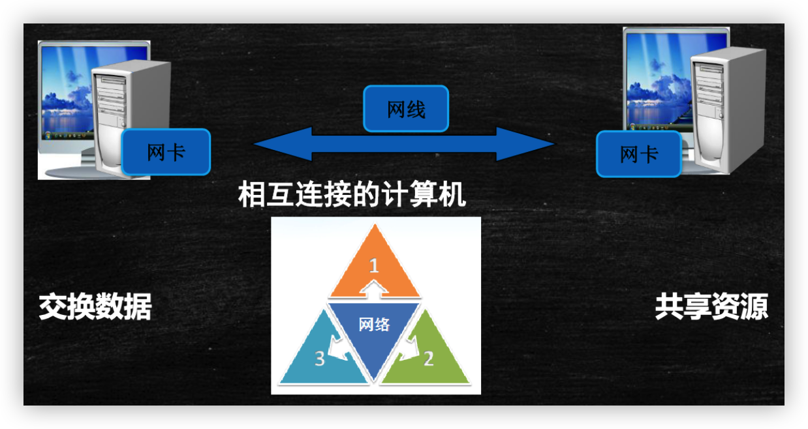

## 网络编程的三要素

- (1) IP地址：唯一标识网络上的每一台计算机
  - 两台计算机之间通信的必备要素
  - IPV4 / IPV6
- (2) 端口号：计算机中应用的标号（代表一个应用程序）
  - 0 ~ 1024之间的端口号，是系统使用或保留的端口号，不建议我们使用
  - 端口号的范围 0~65535
- (3) 通信协议：通信的规则
  - TCP、UDP 协议
  - 网线里面走的仅仅是电信号，我们用协议对这些电信号进行加工处理，解析成我们可使用的信息

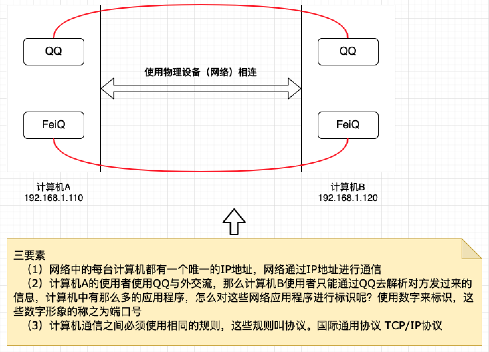

## 网络模型

### 网络模型一

> **OSI参考模式：开放系统互连参考模型（Open System Interconnect）**

- 七层网络协议
- 报文的封装与解析

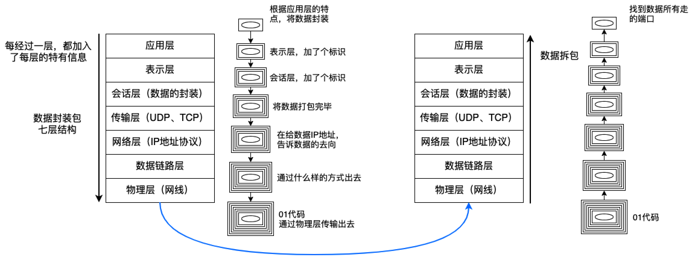

### 网络模型二

> **TCP/IP 参考模型：传输控制/网络协议（Transfer Controln Protocol / Internet Protocol）**

- 由七层结构转变成了四层结构

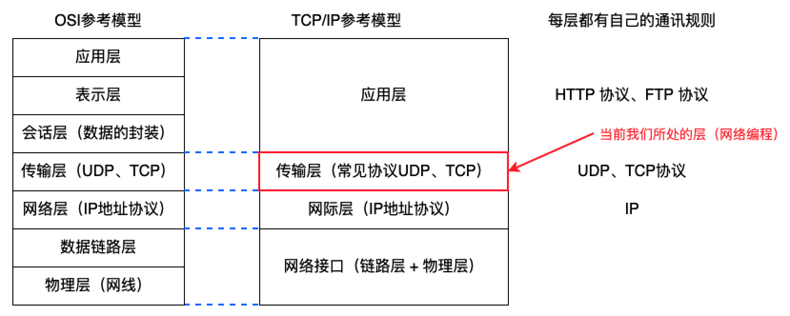

## IP地址的表示方法

- IP地址：32位，由4个8位二进制数组成

- IP表示方法：`点分十进制`

  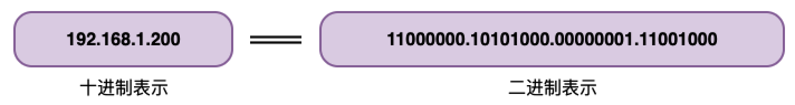

- IP地址 = 网络ID + 主机ID

  - 网络ID：标识计算机或网络设备所在的网段
  - 主机ID：标识特定主机或网络设备

## IP地址的分类

- 地址类用于指定网络ID，并在网络ID和主机ID之间提供分隔方法

- IANA 负责分配 A、B、C类网络地址，具体主机地址由机构组织自行分配

- IP地址类包括

  - A类：
    - 网络ID取值范围：1 ~ 126
  - B类：
    - 网络ID取值范围：128 ~ 191
  - C类：
    - 网络ID取值范围：192 ~ 223
  - D类：
    - 网络ID取值范围：224 ~ 239
  - E类：
    - 网络ID取值范围：240 ~ 255

- IP地址格式

  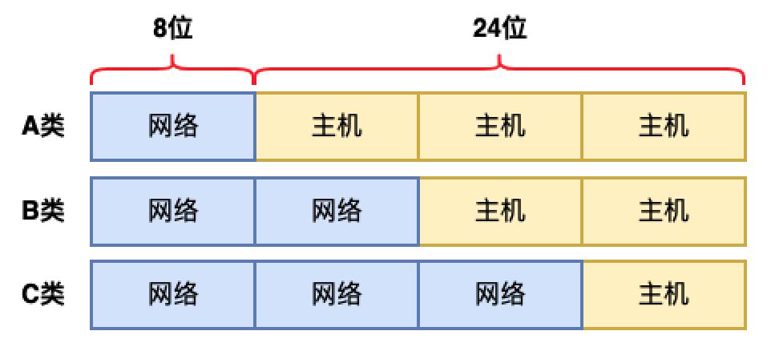

## 特殊的IP地址

- `0.0.0.0`：本机（是不支持通信的）
- `127.0.0.1`：本机回环地址，用于本机测试（是支持通信的）
- `255.255.255.255`：当前子网，一般用于向当前子网广播信息

## IP地址所对应的对象 -> InetAddress

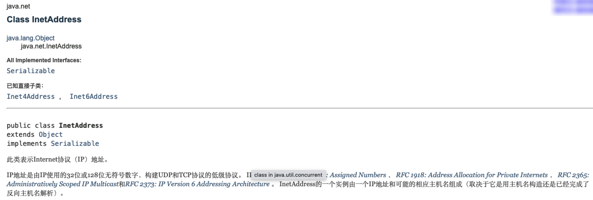

- 常用方法

  | 序号 | 方法                                             | 描述                 |
  | ---- | ------------------------------------------------ | -------------------- |
  | 1    | public static InetAddress getLocalHost()         | 获取主机名和IP地址   |
  | 2    | public String getHostAddress()                   | 获取IP地址           |
  | 3    | public String getHostName()                      | 获取主机名           |
  | 4    | public static InetAddress getByName(String host) | 根据主机名获取IP地址 |

- 获取百度的主机名示例

  ```java
  InetAddress baidu = InetAddress.getByName("www.baidu.com");
  System.out.println("百度主机IP地址:" + baidu.getHostAddress());
  ```

> **注意：有可能返回的主机IP有很多，只是显示了一个**

## 端口

> **port**

- 端口是虚拟的概念，并不是说在主机上真的有若干个端口
- 通过端口，可以在一个主机上运行多个网络应用程序

## 传输协议

### UDP

- 相当于发短信（有字数限制）
- 特点
  1. 不需要建立连接
  2. 数据报的大小限制在64k内
  3. 效率较高，不安全，容易丢包

### TCP

- 相当于打电话，需要建立连接
- 特点
  1. 效率相对比较低，数据传输安全
  2. 三次握手完成（点名 -> 答到 -> 确认）

## Socket 套接字

> 虚拟接口概念

- 网络上的两个程序通过一个双向的通信连接实现数据的交换，这个连接的一端称为一个Socket
- Java中使用Socket完成了TCP程序的开发，使用此类可以方便的建立**可靠的、双向的、持续性的、点对点的**通讯连接
- 在Socket的程序开发中，服务器端使用ServerSocket等待客户端的连接，对于Java的网络程序来讲，每一个客户端都使用一个Socket对象表示

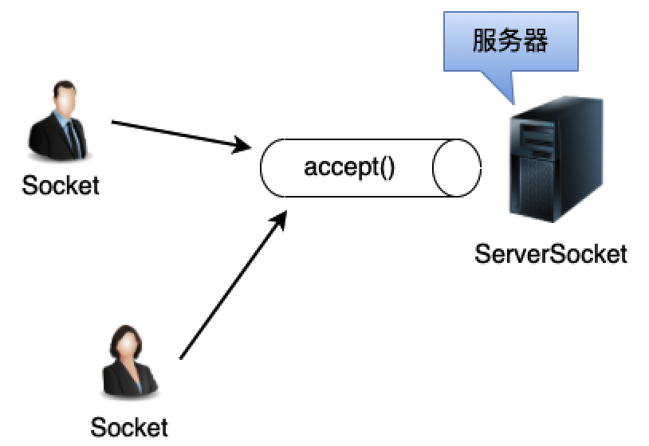


## 基于TCP协议的Socket编程

- 进行网络通信时，Socket需要借助数据流来完成数据的传递工作

  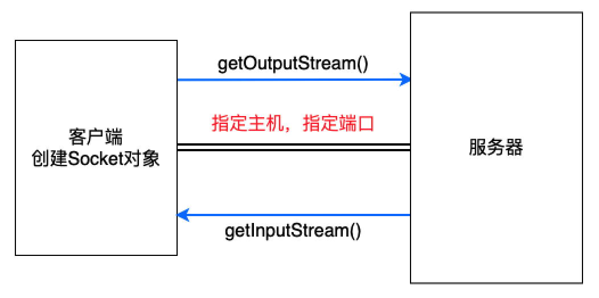

- 流程示例

  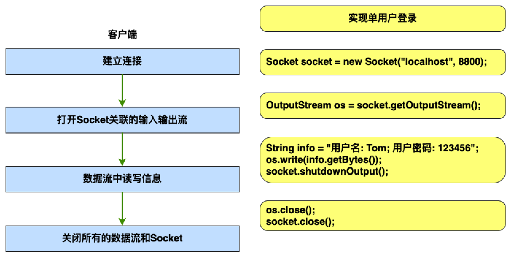

  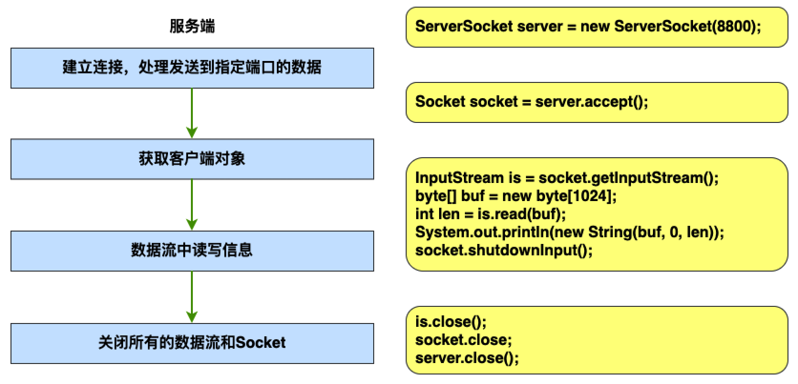

## Socket 如何实现对象的传递？

- 如何传递对象信息呢？

  - 将对象类序列化

  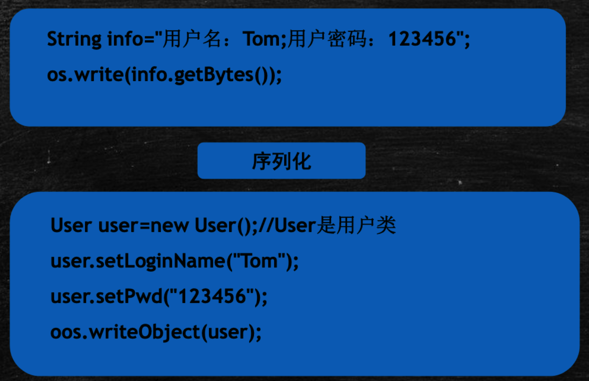

## 基于UDP的网络编程

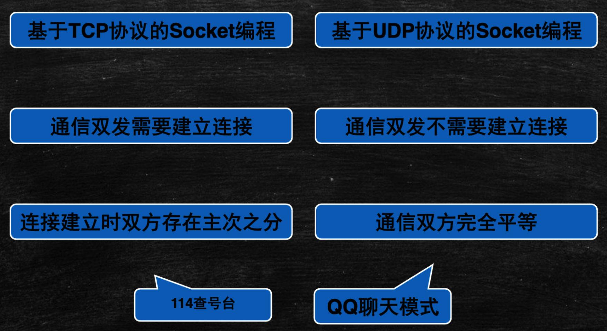

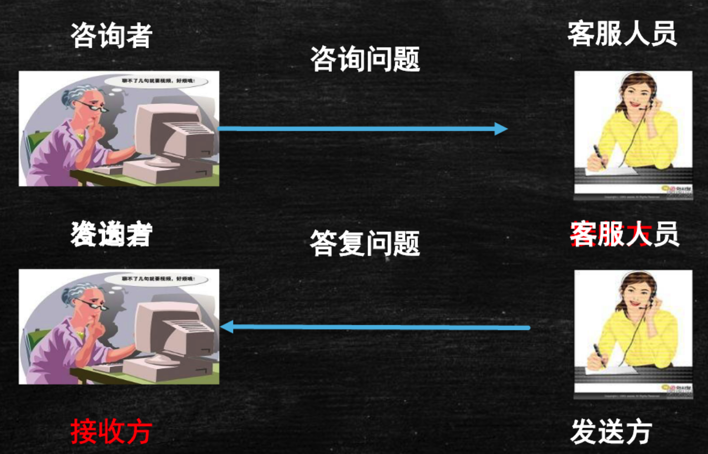

