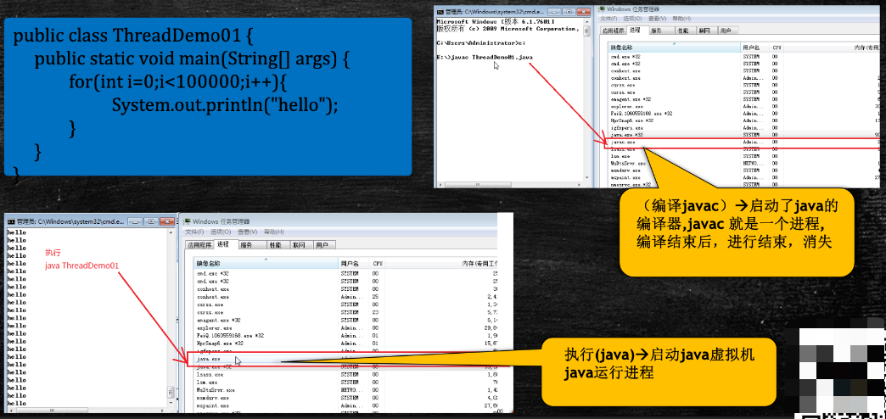
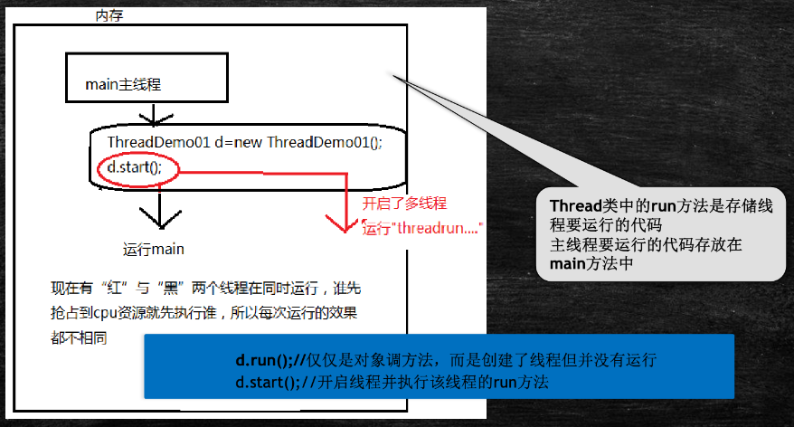
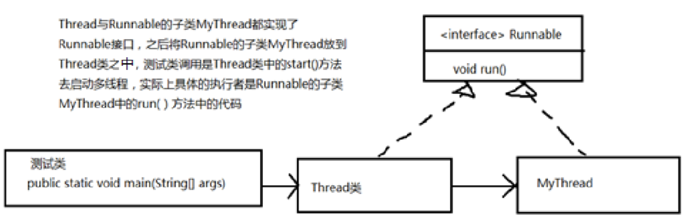
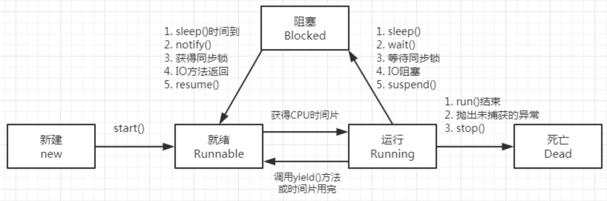
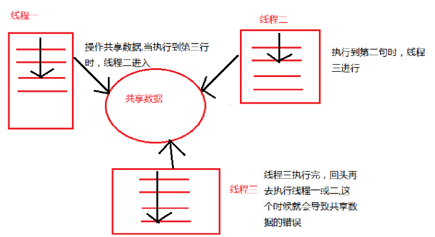
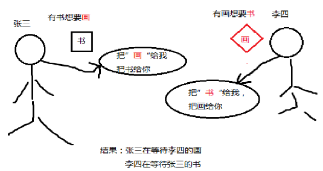
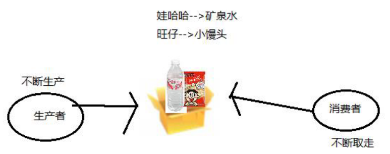
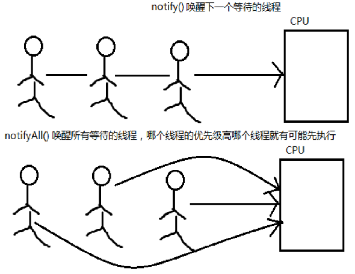

[TOC]

# 🐹 [基础] 线程的基本概念、常用方法、线程状态

> 概述：
>
> - 程序、进程、线程
> - 线程的创建方式，实现Runnable接口或继承Thread类
> - 线程的状态：创建、就绪、运行、阻塞、消亡（标准的五态模型）
> - 线程冻结（阻塞）的几种情况
>   - 调用该线程对象的 wait()方法
>   - 该线程本身调用 sleep()方法
>   - 该线程与另一个线程的 join在一起
> - 线程解冻的几种情况
>   - 该线程对象的 notify()唤醒
>   - sleep()方法休眠时间已到
> - run()方法执行结束，线程进入消亡状态
> - 当多个对象操纵同一共享资源时，要使用同步方法或同步代码块来进行资源的同步处理
> - 过多的同步将产生死锁
> - 生产者与消费者问题（同步、等待与唤醒）

## 线程概念

- 程序：Program，是一个指令的集合
- 进程：Process，是一个静态的概念（正在执行中的程序）
  - 进程是程序的一次静态执行过程，占用特定的地址空间
  - 每个进程都是独立的，由3部分组成，CPU、DATA、CODE
  - 缺点：内存的浪费，CPU的负担
- 线程：是进程中一个 "单一的连续控制流程"（a singles Thread, equential flow of control）
  - 线程又被称为**轻量级进程**（lightweight process）
  - Threads run at the same time, independently of one another
  - 一个进程可以拥有多个并行的（concurrent）线程
  - 一个进程中的线程共享相同的内存单元、内存地址空间 --> 可以访问相同的变量和对象；而且它们从同一个堆中分配对象 --> 通信、数据交换、同步操作
  - 由于线程间的通信是在同一地址空间上进行的，所以不需要额外的通信机制，这就使得通信更简便而且信息传递的速度也更快


## 进程与线程

- 一个进程中至少有一个线程
  - 用图说话，展示进程与线程
    


## javac 与 java

### 图解说明



- 根据图解分析
  1. 编译`javac` --> 启动了java的编译器，javac就是一个进程，编译结束后，执行结束，消失
  2. 执行`java` --> 启动java虚拟机，java运行进程


### Java虚拟机描述

- Java虚拟机启动的时候会有一个进程 java.exe（Windows中后缀为.exe），该进程中至少有一个线程，负责java程序的执行。而且这个线程运行的代码存在于main方法中，该线程称之为主线程。
- 一个进程中的线程共享代码和数据空间。
- 线程结束，进程未必结束，但进程结束，线程一定结束。
- 进程中包含线程，线程是进程的一部分。


## 线程与进程的区别

| 区别     | 进程                                                         | 线程                                                         |
| -------- | ------------------------------------------------------------ | ------------------------------------------------------------ |
| 根本区别 | 作为资源分配的单位                                           | 调度和执行的单位                                             |
| 开销     | 每个进程都有独立的代码和数据空间（进程上下文），进程间的切换会有较大的开销 | 线程可以看成是轻量级的进程，同一类线程共享代码和数据空间，每个线程有独立的运行栈和程序计数器（PC）线程切换的开销小 |
| 所处环境 | 在操作系统中能同时运行多个任务（程序）                       | 在同一个应用程序中有多个顺序流同时执行                       |
| 分配内存 | 系统在运行的时候会为每个进程分配不同的内存区域               | 除了CPU之外，不会为线程分配内存（线程所使用的资源是它所属的进程的资源），线程组只能共享资源 |
| 包含关系 | 没有线程的进程是可以被看作单线程的，如果一个进程内拥有多个线程，则执行过程不是一条线的，而是多条线（线程）共同完成的 | 线程是进程的一部分，所以线程有的时候被称为轻权进程或轻量级进程 |


## 线程的实现

- Java中线程的实现方式
  - 在Java中负责线程的这个功能是 `Java.lang.Thread` 类
  - 可以通过创建 Thread 的实例来创建新的线程
  - 每个线程都是通过某个特定 Thread 对象所对应的方法 `run()` 来完成其操作的，方法 `run()` 称为线程体
  - 通过调用 Thread 类的 `start()` 方法来启动一个线程


### 创建线程的两种基础方式

#### 方式一：继承 `Thread` 类

##### 操作步骤

1. 继承 `Thread` 类
2. 重写 `run` 方法
3. 创建对象，调用 `start()` 方法，启动线程

##### 代码示例

```java
public class ThreadDemo extends Thread {

    /**
     * 程序入库，main()方法是程序的主线程
     * @param args 参数
     */
    public static void main(String[] args) {
        ThreadDemo td = new ThreadDemo();
        // 开启线程，调用start()方法，线程内部会运行run()方法
        td.start();
        for (int i = 0; i < 100; i++) {
            System.out.printf("main()方法，当前线程名称「%s」==> %d\n", Thread.currentThread().getName(), i);
        }
    }

    /**
     * 重写Thread父类run()方法，实现线程需要运行的业务逻辑
     */
    @Override
    public void run() {
        for (int i = 0; i < 1000; i++) {
            System.out.printf("run()方法，当前线程名称「%s」==> %d\n", Thread.currentThread().getName(), i);
        }
    }
}
```

##### 图解执行流程



#### 方式二：实现 `Runnable` 接口

##### 操作步骤

1) 实现 `Runnable` 接口
2) 重写 `run` 方法
3) 创建对象，调用 `start()` 方法，启动线程

##### 代码示例

- [🔗 参考代码链接 🔗](https://github.com/witty-hamster/hard-core/blob/main/multithreading-and-high-concurrency/src/main/java/com/hamster/mahc/demo/RunnableDemo.java)

```java
public class RunnableDemo implements Runnable {

    public static void main(String[] args) {
        RunnableDemo rd = new RunnableDemo();
        Thread thread = new Thread(rd);
        thread.start();
        for (int i = 0; i < 100; i++) {
            System.out.printf("main()方法，当前线程名称「%s」==> %d\n", Thread.currentThread().getName(), i);
        }
    }

    /**
     * 实现接口中的run()方法
     */
    @Override
    public void run() {
        for (int i = 0; i < 1000; i++) {
            System.out.printf("run()方法，当前线程名称「%s」==> %d\n", Thread.currentThread().getName(), i);
        }
    }
}
```


#### 两种实现方式对比

> 🤔思考：两种实现方式哪种用的比较多？？？

- 推荐使用第二种`Runnable`接口实现方式
- 原因有以下两点
  1. Java 是单继承，将继承关系留给最需要的类
  2. 使用 Runnable 接口之后，不需要给共享变量添加 static 关键字，每次创建一个对象，作为共享对象即可
- 继承 Thread类方式的缺点
  - 如果我们的类已经从一个类继承，则无法再继承 Thread类
- 实现 Runnable接口方式的优点
  - 可以同时实现继承，更加通用一些
  - 避免Java的单继承
  - 方便共享资源，同一份资源，可供多个代理访问

## Runnable、Thread 所使用的设计模式

> 使用了代理设计模式

- Runnable 接口，是代理类和被代理类共同实现的

- Thread 类，是代理类

- 类图

  

## 线程状态

### 图解线程状态



### 线程状态分类

> JDK源码中，java.lang.Thread.State 枚举类中详细列举了线程的状态

#### 新生状态

- 用 new关键字建立一个线程后，该线程对象就处于新生状态
- 处于新生状态的线程有自己的内存空间，通过调用 start()方法进入就绪状态

#### 就绪状态

- 处于就绪状态的线程具备了运行条件，但还没有分配到CPU，处于线程就绪队列，等待系统为其分配CPU
- 当系统选定一个等待执行的线程后，它就会从就绪状态进入执行状态，该动作称为 "CPU调度"

#### 运行状态

- 在运行状态的线程执行自己的 run方法中代码，直到等待某资源而阻塞或者完成任务而死亡
- 如果在给定的时间片内没有执行结束，就会被系统给换下来回到等待执行状态

#### 阻塞状态

- 处于运行状态的线程在某些情况下（如执行了 sleep（睡眠）方法，或者等待 I/O设备等资源），将让出CPU并暂时停止自己运行，进入阻塞状态
- 在阻塞状态的线程不能进入就绪队列。只有当引起阻塞的原因消除时（如，睡眠时间已到，或等待的 I/O设备空闲下来），线程便转入就绪状态，重新到就绪队列中排队等待，被系统选中后从原来停止的位置开始继续执行

#### 死亡状态

- 死亡状态是线程生命周期中的最后一个阶段。线程死亡的原因有三个：
  1. 正常运行的线程完成了它的全部工作
  2. 线程被强制性的终止，如通过 stop方法来终止一个线程（此方法不推荐使用）
  3. 线程抛出未捕获的异常


## 线程操作常用API

| 序号 | 方法名称                                       | 描述                                                         |
| :--- | ---------------------------------------------- | ------------------------------------------------------------ |
| 1    | public static native Thread currentThread()    | 返回目前正在执行的线程                                       |
| 2    | public final String getName()                  | 返回线程的名称                                               |
| 3    | public final int getPriority()                 | 返回线程的优先级                                             |
| 4    | public final void setPriority(int newPriority) | 设定线程优先级                                               |
| 5    | public final native boolean isAlive()          | 判断线程是否在活动，如果是，返回true；否则返回false          |
| 6    | public final void join()                       | 调用该方法的线程强制执行，其他线程处于阻塞状态，该线程执行完毕后，其它线程再执行 |
| 7    | public static void sleep(long millis)          | 使用当前正在执行的线程休眠millis秒，线程处于阻塞状态         |
| 8    | public static void yield()                     | 当前正在执行的线程暂停一次，允许其他线程执行，不阻塞，线程进入就绪状态，如果没有其他等待执行的线程，这个时候当前线程就会马上恢复执行 |
| 9    | public final void stop()                       | 强迫线程停止执行。已过时，不推荐使用                         |


## 阻塞状态

> 三种暂停当前线程执行的方法
>
> 	- sleep
> 	- yield
> 	- join

1. sleep
   - 不会释放锁，Sleep时别的线程也不可以访问锁定对象
2. yield
   - 让出CPU的使用权，从运行态直接进入就绪态
   - 让CPU重新挑选哪一个线程进入运行状态
3. join
   - 当某个线程等待另一个线程执行结束后，才继续执行
   - 使调用该方法的线程在此之前执行完毕，也就是等待调用该方法的线程执行完毕后再往下继续执行

## 共享资源不一致现象

- 由于线程不同步，导致共享资源不一致



### 如何解决多线程的安全性问题？

> 两种方式：
>
> - 同步代码块
> - 同步方法

- 线程同步的前提条件
  - 必须有两个或两个以上的线程
  - 必须是多个线程使用同一资源
  - 必须保证同步中只能有一个线程在运行

- 同步代码块解决线程安全问题

  ```java
  public class TickerSafe1 implements Runnable {
  
      /** 定义票的个数 */
      private int ticker = 5;
  
      @Override
      public void run() {
          // 处理购票逻辑
          for (int i = 0; i < 10; i++) {
              try {
                  // 模拟卖票过程
                  Thread.sleep(300);
              } catch (InterruptedException e) {
                  e.printStackTrace();
              }
              // 同步代码块 ==> 通常将当前对象作为同步对象
              synchronized (this) {
                  if (ticker > 0) {
                      System.out.printf("%s用户正在买第%d张票\n", Thread.currentThread().getName(), ticker--);
                  }
              }
          }
      }
  
      public static void main(String[] args) {
          TickerSafe1 tickerRunnable = new TickerSafe1();
          Thread t1 = new Thread(tickerRunnable);
          Thread t2 = new Thread(tickerRunnable);
          Thread t3 = new Thread(tickerRunnable);
          Thread t4 = new Thread(tickerRunnable);
  
          t1.start();
          t2.start();
          t3.start();
          t4.start();
      }
  }
  ```

- 同步方法解决线程安全问题

  ```java
  public class TickerSafe2 implements Runnable {
  
      /** 定义票的个数 */
      private int ticker = 5;
  
      @Override
      public void run() {
          // 处理购票逻辑
          for (int i = 0; i < 10; i++) {
              try {
                  // 模拟卖票过程
                  Thread.sleep(300);
              } catch (InterruptedException e) {
                  e.printStackTrace();
              }
              sale();
          }
      }
  
      /**
       * 使用同步方法，解决线程安全问题
       */
      public synchronized void sale() {
          if (ticker > 0) {
              System.out.printf("%s用户正在买第%d张票\n", Thread.currentThread().getName(), ticker--);
          }
      }
  
      public static void main(String[] args) {
          TickerSafe2 tickerRunnable = new TickerSafe2();
          Thread t1 = new Thread(tickerRunnable);
          Thread t2 = new Thread(tickerRunnable);
          Thread t3 = new Thread(tickerRunnable);
          Thread t4 = new Thread(tickerRunnable);
  
          t1.start();
          t2.start();
          t3.start();
          t4.start();
      }
  }
  ```


### 同步监视器

- synchronized(obj){}，中的 obj 称为同步监视器
- 同步代码块中同步监视器可以是任何对象，但是推荐使用共享资源作为同步监视器
- 同步方法中无需指定同步监视器，因为同步方法的监视器是 this，也就是该对象本身

### 同步监视器的执行过程

- 第一个线程访问，锁定同步监视器，执行其中代码
- 第二个线程访问，发现同步监视器被锁定，无法访问
- 第一个线程访问完毕，解锁同步监视器
- 第二个线程访问，发现同步监视器未锁，锁定并访问

## 死锁

### 什么是死锁

> 假设有两个线程A、B，同时提供两个资源甲、乙。现有如下情况，资源甲给到了线程A，资源乙给到了线程B，但是线程A如果想要运行，必须同时拥有资源甲、资源乙。同样，线程B也是同时需要甲、乙两个资源时，才能运行。由于资源乙被线程B占用着，导致线程A获取不到资源乙；同样问题也出现在线程B上，因此出现了死锁。谁都不释放资源，那么谁也不能运行。

- 死锁现象示例图

		

- 线程同步可以保证资源共享操作的正确性，但是过多的同步也会产生死锁
- 死锁一般情况下，表示互相等待，是程序运行时出现的一种问题

## 线程的生产者与消费者

- 分析生产者与消费者

  

  - 生产者不断生产，消费者不断取走生产者生产的产品
  - 生产者生产产品放到一个区域中（共享资源：可以是共享对象、共享变量等），之后消费者从此区域里取出产品

### 线程间的通信

- Java 提供了3个方法，解决线程之间的通信问题

| 方法名                                   | 作用                                                         |
| ---------------------------------------- | ------------------------------------------------------------ |
| final void wait()                        | 表示线程一直等待，直到其他线程通知                           |
| final void wait(long timeout)            | 表示线程等待指定毫秒参数的时间                               |
| final void wait(long timeout, int nanos) | 表示线程等待指定毫秒、微秒的时间                             |
| final void notify()                      | 表示唤醒一个处于等待状态的线程                               |
| final void notifyAll()                   | 表示唤醒同一个对象上所有调用wait()方法的线程，优先级别高的线程优先运行 |

> 注意事项：以上方法都只能在同步方法或者同步代码块中使用，否则会抛出异常

### Object 类中的等待与唤醒


