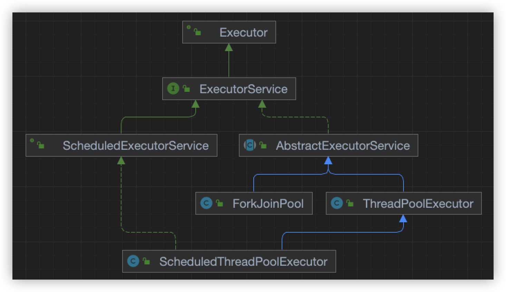
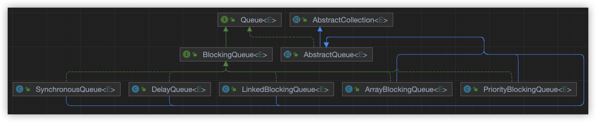

# 🐤 [基础] Java多线程源码解读

## 核心包

- `java.util.concurrent`，也就是我们常说的 `JUC`
- 提供实用程序类常用于并发编程

## 核心类

- `Executor` 接口。线程执行器的最上层封装
- `Executors` 工具类。线程池创建、线程工厂、线程任务创建的工具类
- `ExecutorService` 接口。继承自`Executor`接口，对Executor接口做功能性扩展
- `BlockingQueue<E>` 接口。阻塞队列的最上层封装
  - 其中，泛型E表示阻塞队列中元素的类型

## Executor 类图



- Executor 接口中提供了一个 execute() 方法
  - 该方法是线程执行任务的核心方法，具体的执行过程可参考 ThreadPoolExecutor 类中对重载的 execute() 方法

## :star2: ThreadPoolExecutor

> 核心线程池创建、执行的类
>
> **特别重要**

### 线程池的创建

```java
public ThreadPoolExecutor(int corePoolSize,
                              int maximumPoolSize,
                              long keepAliveTime,
                              TimeUnit unit,
                              BlockingQueue<Runnable> workQueue,
                              ThreadFactory threadFactory,
                              RejectedExecutionHandler handler) {
}
```

- ThreadPoolExecutor 的构造方法
  - 参数
    - corePoolSize：即使空闲时仍保留在池中的线程数，除非设置 allowCoreThreadTimeOut
    - maximumPoolSize：线程池中允许的最大线程数
    - keepAliveTime：当线程数大于内核时，这时多余的空闲线程在终止前等待新任务的最大时间
    - unit：keepAliveTime参数的时间单位
    - workQueue：用于在执行任务之前使用的队列。 这个队列将仅保存execut方法提交的Runnable任务
    - threadFactory：执行程序创建新线程时使用的工厂
    - handler：执行被阻止时使用的处理程序，因为达到线程限制和队列容量
  - 异常
    - `IllegalArgumentException` ：如果以下某项成立时，会报出该异常
      - corePoolSize < 0
      - keepAliveTime < 0
      - maximumPoolSize <= 0
      - maximumPoolSize < corePoolSize
    - `NullPointerException` ：如果一下情况发生时，会报出该异常
      - workQueue 为空
      - threadFactory 为空 
      - handler 为空

### 线程任务的执行

- `ThreadPoolExecutor#execute(Runnable)` 

- 功能：

  - 在将来某个时候执行给定的任务。 任务可以在新线程或现有的合并的线程中执行。 如果任务无法提交执行，由于此执行程序已关闭或已达到其容量，该任务将由当前 `RejectedExecutionHandler` 处理。

- 代码如下

  ```java
  public void execute(Runnable command) {
      if (command == null)
        throw new NullPointerException();
      int c = ctl.get();
      if (workerCountOf(c) < corePoolSize) {
        if (addWorker(command, true))
          return;
        c = ctl.get();
      }
      if (isRunning(c) && workQueue.offer(command)) {
        int recheck = ctl.get();
        if (! isRunning(recheck) && remove(command))
          reject(command);
        else if (workerCountOf(recheck) == 0)
          addWorker(null, false);
      }
      else if (!addWorker(command, false))
        reject(command);
  }
  ```

  - 核心过程分为三步：
    - STEP 01. 如果运行的线程少于 corePoolSize，尝试使用给定命令启动一个新线程作为其第一个任务。对 addWorker 的调用以原子方式检查 runState 和 workerCount，因此通过返回 false 来防止在不应该添加线程时添加线程的错误警报。
    - STEP 02. 如果一个任务可以成功排队，那么我们仍然需要仔细检查我们是否应该添加一个线程（因为现有的线程自上次检查后就死了）或者线程池在进入此方法后关闭。因此，我们重新检查状态，如果有必要，停止排队，则回滚，或者如果没有，则启动一个新线程。
    - STEP 03. 如果我们不能排队任务，那么我们尝试添加一个新线程。如果它失败了，我们知道线程池已经关闭或饱和，因此拒绝任务。

## BlockingQueue 类图



