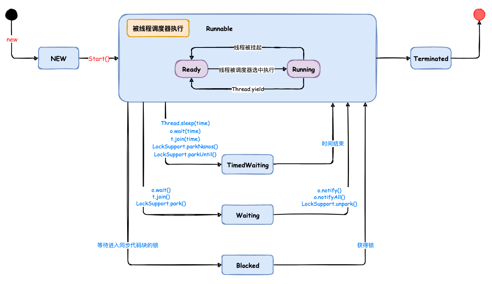

# Java线程进阶

## 【回顾】线程的基本概念

### 如何看进程与线程？

#### 进程

> 就是应用程序在内存中分配的空间，也就是正在运行的程序

- 特点
  - 各个进程之间互不干扰
  - 进程保存着程序每一个时刻运行的状态

> 示例：
>
> ​	杀毒软件APP、QQ APP、微信APP等，这些软件在运行时都是一个进程

#### CPU与进程之间如何作用

CPU采用时间片轮转的方式运行进程。CPU为每个进程分配一个时间段，称作它的时间片。

- 如果在**时间片结束时，进程还在运行**，则暂停整个进程的运行，并且**CPU分配给另一个进程**（这个过程叫做<b style="color:#009900">上下文切换</b>）
- 如果进程在时间片结束前阻塞或结束，则CPU立即进行切换，不用等待时间片用完
- 当进程暂停时，CPU会保存当前进程的状态（进程标识、进程使用的资源等），在下一次切换回来时，根据之前保存的状态进行恢复，接着继续执行

#### 线程

> 一个进程中的不同执行路径，也就是进程中的每一个子任务，都叫做线程
>
> 示例：
>
> ​	杀毒软件中既有杀毒功能、又有垃圾清理功能。这两个功能在分别对应杀毒软件进程中的两个线程

### 进程与线程之间的区别

> 进程让操作系统的并发成为了可能，而线程让进程内部并发成为了可能。两者共同作用，极大的提高了操作系统的性能

#### 🤔 多进程的方式也可以实现并发功能，但为什么我们要使用多线程呢？

多进程方式确实可以实现并发，但使用多线程，有以下几点优势：

- <b style="color:#ff0000">进程间的通信比较复杂，而线程间的通信比较简单</b>，通常情况下，我们需要使用<b style="color:#ff0000">共享资源</b>，这些资源在线程间的通信比较容易
- <b style="color:#ff0000">进程是重量级的，而线程是轻量级的</b>，故多线程方式的系统开销更小

由以上两点，我们可以看出，使用多线程方式更加优越

#### 进程和线程的区别

进程是一个独立的运行环境，而线程是在进程中执行的一个任务。

- **本质上**的区别是 —— <b style="color:#ff0000">是否单独占有内存地址空间及其他系统资源（比如：I/O）</b>
  - 进程单独占有一定的内存地址空间，所以进程间存在内存隔离，数据是分开的，数据共享复杂但是同步简单，各个进程之间互不干扰；而线程共享所属进程占有的内存地址空间和资源，数据共享简单，但是同步复杂
  - 进程单独占有一定的内存地址空间，一个进程出现问题不会影响其他进程，不影响主程序的稳定性，可靠性高；一个线程崩溃可能影响整个程序的稳定性，可靠性较低
  - 进程单独占有一定的内存地址空间，进程的创建和销毁不仅需要保存寄存器和栈信息，还需要资源的分配回收以及页调度，开销较大；线程只需要保存寄存器和栈信息，开销较小
- 另一个重要的区别 —— <b style="color:#ff0000">进程是操作系统进行资源分配的基本单位，而线程是操作系统进行调度的基本单位（即CPU分配时间的单位）</b>

## 【回顾】线程的创建方式、线程状态、线程常用方法

### 线程创建方式

> 线程创建时，均需要重写 run()方法，根据具体业务，在run()方法中写入具体的逻辑

创建方式有以下两种：

1. 创建类继承 Thread类
2. 创建类实现 Runnable接口

### 线程启动的方式

三种启动线程的方式：

1. 继承Thread类，直接new这个类，后调用start()方法
2. 实现Runnable接口，通过构造传入，后调用start()方法
3. 利用线程池

有时候也有说，启动线程的四种方式，除以上三种外，还有一个方式是根据第二种方式的变体。在创建Thread对象时，直接在构造体中传入Runnable匿名内部类（Lambda形式）

### 线程常用方法

1. `sleep()` 方法：线程休眠方法，参数为休眠时间，单位为毫秒ms
2. `yield()` 方法：线程主动退出资源方法，退出后会自动回到就绪队列中，之后会重新抢夺资源 {一般比较少使用}
3. `join()` 方法：线程加入方法，当前线程需要等待加入的线程执行完毕后，才能继续执行

🤔 【思考】如果需要保证两个线程顺序执行，怎么实现 ?

- 可以采用 `join()`方法，将一个线程加入到另一线程中，可保证两个线程的顺序执行

### 线程状态

> 线程状态均有 JVM管理

- 线程状态迁移图

  

