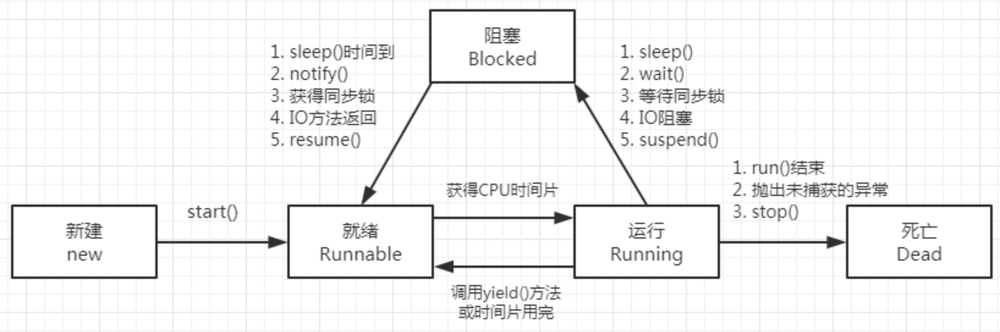

# Java线程进阶

## :avocado: 【回顾】线程的基本概念

### 如何看进程与线程？

#### 进程

> 就是应用程序在内存中分配的空间，也就是正在运行的程序

- 特点
  - 各个进程之间互不干扰
  - 进程保存着程序每一个时刻运行的状态

> 示例：
>
> ​	杀毒软件APP、QQ APP、微信APP等，这些软件在运行时都是一个进程

#### CPU与进程之间如何作用

CPU采用时间片轮转的方式运行进程。CPU为每个进程分配一个时间段，称作它的时间片。

- 如果在**时间片结束时，进程还在运行**，则暂停整个进程的运行，并且**CPU分配给另一个进程**（这个过程叫做<b style="color:#009900">上下文切换</b>）
- 如果进程在时间片结束前阻塞或结束，则CPU立即进行切换，不用等待时间片用完
- 当进程暂停时，CPU会保存当前进程的状态（进程标识、进程使用的资源等），在下一次切换回来时，根据之前保存的状态进行恢复，接着继续执行

#### 线程

> 一个进程中的不同执行路径，也就是进程中的每一个子任务，都叫做线程
>
> 示例：
>
> ​	杀毒软件中既有杀毒功能、又有垃圾清理功能。这两个功能在分别对应杀毒软件进程中的两个线程

### 进程与线程之间的区别

> 进程让操作系统的并发成为了可能，而线程让进程内部并发成为了可能。两者共同作用，极大的提高了操作系统的性能

#### :thinking: 【思考】 多进程的方式也可以实现并发功能，但为什么我们要使用多线程呢？

多进程方式确实可以实现并发，但使用多线程，有以下几点优势：

- <b style="color:#ff0000">进程间的通信比较复杂，而线程间的通信比较简单</b>，通常情况下，我们需要使用<b style="color:#ff0000">共享资源</b>，这些资源在线程间的通信比较容易
- <b style="color:#ff0000">进程是重量级的，而线程是轻量级的</b>，故多线程方式的系统开销更小

由以上两点，我们可以看出，使用多线程方式更加优越

#### 进程和线程的区别

进程是一个独立的运行环境，而线程是在进程中执行的一个任务。

- **本质上**的区别是 —— <b style="color:#ff0000">是否单独占有内存地址空间及其他系统资源（比如：I/O）</b>
  - 进程单独占有一定的内存地址空间，所以进程间存在内存隔离，数据是分开的，数据共享复杂但是同步简单，各个进程之间互不干扰；而线程共享所属进程占有的内存地址空间和资源，数据共享简单，但是同步复杂
  - 进程单独占有一定的内存地址空间，一个进程出现问题不会影响其他进程，不影响主程序的稳定性，可靠性高；一个线程崩溃可能影响整个程序的稳定性，可靠性较低
  - 进程单独占有一定的内存地址空间，进程的创建和销毁不仅需要保存寄存器和栈信息，还需要资源的分配回收以及页调度，开销较大；线程只需要保存寄存器和栈信息，开销较小
- 另一个重要的区别 —— <b style="color:#ff0000">进程是操作系统进行资源分配的基本单位，而线程是操作系统进行调度的基本单位（即CPU分配时间的单位）</b>

## :avocado: 【回顾】线程的创建方式、线程状态、线程常用方法

### 线程创建方式

> 线程创建时，均需要重写 run()方法，根据具体业务，在run()方法中写入具体的逻辑

创建方式有以下两种：

1. 创建类继承 Thread类
2. 创建类实现 Runnable接口

### 线程启动的方式

三种启动线程的方式：

1. 继承Thread类，直接new这个类，后调用start()方法
2. 实现Runnable接口，通过构造传入，后调用start()方法
3. 利用线程池

有时候也有说，启动线程的四种方式，除以上三种外，还有一个方式是根据第二种方式的变体。在创建Thread对象时，直接在构造体中传入Runnable匿名内部类（Lambda形式）

### 线程常用方法

1. `sleep()` 方法：线程休眠方法，参数为休眠时间，单位为毫秒ms
2. `yield()` 方法：线程主动退出资源方法，退出后会自动回到就绪队列中，之后会重新抢夺资源 {一般比较少使用}
3. `join()` 方法：线程加入方法，当前线程需要等待加入的线程执行完毕后，才能继续执行

:thinking: 【思考】如果需要保证两个线程顺序执行，怎么实现 ?

- 可以采用 `join()`方法，将一个线程加入到另一线程中，可保证两个线程的顺序执行

### :rainbow_flag: 线程状态

> 线程状态均由 JVM管理
>
> - 线程在程序执行过程中有6中状态。在宏观上有五态模型
>
> - 五态模型（参考下图）
>
>   - 新生 -> 就绪 -> 运行 -> 终止
>
>     ​				\  阻塞 /
>
> - 程序运行过程中的线程状态，可通过`java.lang.Thread.state`枚举类查看支持的线程状态有哪些
>
> - 线程执行过程中，可通过`Thread.getState()`获取线程状态

- 线程五态模型

  
  
- 线程状态迁移图

  

- 线程各状态说明

  - `NEW`：尚未启动的线程处于此状态。在new线程对象时，会处于此状态

  - `RUNNABLE`：可运行线程的线程状态。处于可运行状态的线程正在Java虚拟机中执行，但它可能正在等待来自操作系统的其他资源（例如，处理器）。此状态下还可分为两个内部小状态

    - `Ready`：就绪状态（线程从运行态被挂起、执行yield时，会变成就绪状态）
    - `Running`：运行状态（线程从就绪态被调度器选中后，便会变成运行态）

  - `BLOCKED`：线程阻塞等待监视器锁的线程状态。处于阻塞状态的线程正在等待监视器锁进入同步块/方法，或在调用`Object.wait()`后重新进入同步块/方法

    - 例如，由`synchronized`修饰的同步代码块或同步方法，未获取锁的线程处于当前状态

  - `WAITING`：等待线程的线程状态。由于调用以下方法之一，线程处于等待状态：

    - `Object.wait()` 没有超时
    - `Thread.join()` 没有超时
    - `LockSupport.park()`

    > 处于等待状态的线程正在等待另一个线程执行特定操作。例如：
    >
    > 1. 一个线程对对象调用`Object.wait()`正在等待另一个线程对该对象调用`Object.notify()`或`Object.notifyAll()`
    > 2. 已调用`Thread.join()`的线程正在等待指定线程终止

  - `TIMED_WAITING`：具有指定等待时间的等待线程的线程状态。由于以指定的等待时间调用以下方法之一，线程处于定时等待状态：

    - `Thread.sleep()`
    - `Object.wait()`
    - `Thread.join()`
    - `LockSupport.parkNanos()`
    - `LockSupport.parkUntil()`

  - `TERMINATED`：已终止线程的线程状态。线程以完成执行


## :lock: 锁（synchronized）

> 参考文献
>
> - https://blog.csdn.net/m0_45861545/article/details/122533252

- 为什么要上锁？
  - 在并发编程中存在<b style="color:#ff0000">线程安全</b>问题，主要在以下两方面，会产生该问题：
    - 存在共享数据
    - 多线程共同操作共享数据
  - 使用关键字 `synchronized` 可以保证在同一时刻，只有一个线程可以执行某个方法或某个代码块，同时 `synchronized` 可以保证一个线程的变化可见（可见性），即可以代替 `volatile` 关键字

### `synchronized` 实现原理

> HotSpot虚拟机是现在 Sun JDK 和 Open JDK 中所带的虚拟机，是目前使用范围最广的Java虚拟机

#### 对象的组成

在HotSpot虚拟机中，对象在内存中存储的布局可分为 3块区域：对象头（Header）、实例数据（Instance Data）和对齐填充。

- <b style="color:#0088ff">实例数据</b>

  - 对象真正存储的有效信息，也是程序代码中所定义的各种类型的字段内容。无论是从父类继承下来的，还是在子类中定义的，都需要记录起来。这部分的存储顺序会受到虚拟机分配策略参数和字段在Java源码中定义顺序的影响，HotSpot虚拟机默认分配策略为 longs/doubles、ints、shorts\chars、bytes\booleans、oops（Ordinary Object Pointers），从分配策略中可以看出，相同宽度的字段总是被分配到一起

- <b style="color:#0088ff">对齐填充</b>

  - 这部分并不是必然存在的，也没有特别的含义，它仅仅起着占位符的作用。由于HotSpot VM的自动内存管理系统要求对象起始地址必须是8字节的整数倍，因此，当对象实例数据部分没有对齐时，就需要通过对齐填充来补全

- <b style="color:#0088ff">:star2::star2: 对象头</b>

  - 用于存储对象自身的运行时数据。Java对象头包含三部分，分别是Mark Word、Class Metadata Address、Array length。三部分内容说明

    - `Mark Word`：用来存储对象的 hashCode，GC分代年龄及锁信息
    - `Class Metadata Address`：用来存储对象类型的指针
    - `Array length`：用来存储数组对象的长度。如果对象不是数组类型，则没有 `Array length` 信息

  - synchronized 锁信息包括锁的标志和锁的状态，这些信息都存放在对象头的 Mark Word 这一部分

    

  - Mark Word里默认数据是存储对象的HashCode等信息，但是会随着对象的运行改变而发生变化，不同的锁状态对应着不同的记录存储方式

    

  - Synchronized 通常被称为重量级锁，它的早期设计并不包含锁升级机制，所以性能较差，那个时候只有无锁和有锁之分，但是1.6之后对其进行优化，为了减少获取锁和释放锁带来的性能消耗，新增了轻量级锁和偏向锁，所以需要重点关注这两种状态的原理，以及它们的区别

#### 锁的四种状态

在Java 6中，锁一共被分为4种状态，级别由低到高依次是：无锁状态、偏向锁状态、轻量级锁状态、重量级锁状态。随着线程竞争情况的升级，锁的状态会从无锁状态逐步升级到重量级锁状态。锁可以升级却不能降级，这种只能升不能降的策略，是为了提高效率

从对象头的存储内容可以看出锁的状态都保存在对象头中，Synchronized也不例外，当其从轻量级锁膨胀为重量级锁时，锁标识位为10，其中指针指向的是 monitor对象（也称为管程或监视器锁）的起始地址。

关于Synchronized的实现在Java对象头里较为简单，只是改变一下标识位，并将指针指向 monitor对象的起始地址，其实现的重点是 monitor对象

#### 代码方式梳理实现原理

参考代码如下：

```java
public class Demo {
  
  // 同步方法
  public synchronized void method1() {
    System.out.println("Hello, do method1.");
  }
  
  public void method2() {
    // 同步代码块
    synchronized (this) {
      System.out.println("Let's do method2.");
    }
  }
}
```

以上代码是Synchronized最常用的两种方式，下面执行 `javap -c -v` 命令进行反汇编，过滤掉其他无用信息，反汇编结果如下：

```java
public synchronized void method1();
		descriptor: ()V
    flags: ACC_PUBLIC, ACC_SYNCHRONIZED
    Code:
			stack=2, locals=1, args_size=1
        0: getstatic		  #2							// Field java/lang/System.out:Ljava/io/PrintStream;
        3: ldc					  #3							// String Hello, do method1.
        5: invokevirtual	#4							// Method java/io/PrintStream.println:(Ljava/lang/String;)V
        8: return
          
public void method2();
		descriptor: ()V
    flags: ACC_PLUBLIC
    Code:
			stack=2, locals=3, args_size=1
        0: aload_0
        1: dup
        2: astore_1
        3: monitorenter
        4: getstatic			#2							// Field java/lang/System.out:Ljava/io/PrintStream;
        7: ldc						#5							// String Let's do method2.
       	9: invokevirtual	#4							// Method java/io/PrintStream.println:(Ljava/lang/String;)V
       12: aload_1
       13: monitorexit
       14: goto						22
       17: astore_2
       18: aload_1
       19: monitorexit
       20: aload_2
       21: athrow
       22: return
```

根据上面反汇编结果可以看出，JVM对于同步方法和同步代码块的处理方式不同。

- 对于同步方法，JVM采用 `ACC_SYNCHRONIZED` 标记符来实现同步
- 对于同步代码块，JVM采用 `monitorenter` 和 `monitorexit` 这两个指令实现同步

##### ACC_SYNCHRONIZED 标识符

> 方法级的同步是隐式的。同步方法的常量池中会有一个 `ACC_SYNCHRONIZED` 标志。当某个线程要访问某个方法的时候，会检查是否有 `ACC_SYNCHRONIZED` 标志，如果有设置，则需要先获得监视器锁 monitor，然后开始执行方法，方法执行之后再释放监视器锁monitor。这时如果其他线程来请求执行方法，会因为无法获得监视器锁而被阻断住。值的注意的是，如果在方法执行过程中，发生了异常，并且方法内部并没有处理该异常，那么在异常被抛到方法外面之前监视器锁会被自动释放

##### monitorenter 和 monitorexit 指令

> 可以把执行 `monitorenter` 指令理解为加锁，执行 `monitorexit` 理解为释放锁。每个对象维护着一个记录被锁次数的计数器。未被锁定的对象的该计数器为0，当一个线程获得锁（执行 monitorenter）后，该计数器自增变为1，当同一个线程再次获得该对象的锁的时候，计数器再次自增。当同一个线程释放锁（执行 monitorexit）的时候，计数器再自减。当计数器为0的时候，锁将被释放，其他线程便可获得锁

但是上面的反汇编结果并不是仅有一个monitorexit指令，而是出现了两条monitorexit指令，这是为什么呢？

> 原因是这样的，编译器需要确保方法中调用过的每条monitorenter指令都要执行对应的monitorexit指令。为了保证在方法异常时，monitorenter和monitorexit指令也能正常配对执行，编译器会自动产生一个异常处理器，它的目的就是用来执行异常的monitorexit指令。而字节码中多出的monitorexit指令，就是异常结束时，被执行用来释放monitor的

#### synchronized实现原理总结

1. synchronized同步代码块：synchronized关键字经过编译之后，会在同步代码块前后分别形成monitorenter和monitorexit字节码指令，在执行monitorenter指令的时候，首先尝试获取对象的锁，如果这个锁没有被锁定或者当前线程已经拥有了那个对象的锁，锁的计数器就加1，在执行monitorexit指令时会将锁的计数器减1，当减为0的时候就释放锁。如果获取对象锁一直失败，那当前线程就要阻塞等待，直到对象锁被另一个线程释放为止
2. 同步方法：方法级的同步是隐式的，无需通过字节码指令来控制，JVM可以从方法常量池的方法表结构中的ACC_SYNCHRONIZED访问标志得知一个方法是否声明为同步方法。当方法调用时，调用指令会检查方法的ACC_SYNCHRONIZED访问标志是否被设置，如果设置了，执行线程就要求先持有monitor对象，然后才能执行方法，最后当方法执行完（无论是正常完成还是非正常完成）时释放monitor对象。在方法执行期间，执行线程持有了管程，其他线程都无法再次获取同一个管程

monitorenter 和 monitorexit 指令是通过 monitor 对象实现的。

每个对象都有一个监视器锁（monitor）与之对应。当monitor被占用时就会处于锁定状态，线程执行monitorenter指令时尝试获取monitor的所有权，过程如下：

1. 如果monitor的进入数为0，则该线程进入monitor，然后将进入数设置为1，该线程即为monitor的所有者
2. 如果线程已经占用该monitor，只是重新进入，则进入monitor的进入数加1
3. 如果其他线程已经占用了monitor，则该线程进入阻塞状态，直到monitor的进入数为0，再重新尝试获取monitor的所有权

通过 monitorenter 和 monitorexit 两个指令可以清楚的看出synchronized的实现原理，==synchronized的语义底层是通过一个 monitor的对象来完成==，其实wait/notify等方法也依赖于monitor对象，这就是为什么只有在同步的块或者方法中才能调用wait/notify等方法，否则会抛出异常`java.lang.IllegalMonitorStateException`

#### synchronized 是如何保证原子性、有效性和可见性的？

- 原子性：即一个操作或者多个操作，要么全部执行并且执行的过程不会被任何因素打断，要么就都不执行

  > Java内存模型提供了字节码指令 monitorenter 和 monitorexit 来隐式的使用这两个操作，在 synchronized 块之间的操作是具备原子性的。
  >
  > 
  >
  > 线程1在执行 monitorenter 指令的时候，会对 monitor进行加锁，加锁后其他线程无法获得锁，除非线程1主动解锁。即使在执行过程中，由于某种原因，比如CPU时间片用完，线程1放弃了CPU，但是它并没有进行解锁。而由于synchronized的锁是可重入的，下一个时间片还是只能被他自己获取到，还是会继续执行代码。直到所有代码执行完。这就保证了原子性

- 有序性：程序执行的顺序按照代码的先后顺序执行

  > 在并发时，程序的执行可能会出现乱序。给人的直观感觉就是：写在前面的代码，会在后面执行。但是synchronized提供了有序性保证，这其实和`as-if-serial`语义有关
  >
  > `as-if-serial` 语义是指不管怎么重排序（编译器和处理器为了提高并发度），单线程程序的执行结果都不能被改变。编译器的处理器无论如何优化，都必须遵守 `as-if-serial` 语义。只要编译器和处理器都遵守了这个语义，那么就可以认为单线程程序是按照顺序执行的，由于synchronized修饰的代码，同一时间只能被同一个线程访问。那么可以认为是单线程执行的。所以可以保证其有序性。但需要注意的是synchronized虽然能够保证有序性，但是无法禁止指令重排和处理器优化

- 可见性：当多个线程访问同一个变量时，一个线程修改了这个变量值，其他线程能够立即看到修改的值。被synchronized修饰的代码，在开始执行时会加锁，执行完成后会进行解锁，但在一个变量解锁之前，必须先把变量同步会主存中，这样解锁后，后续其他线程就可以访问到被修改后的值，从而保证可见性


