# 锁 Synchronized :closed_lock_with_key:

> 参考文献
>
> - [Synchronized锁原理](https://blog.csdn.net/m0_45861545/article/details/122533252)
> - [Synchronized锁升级过程](https://blog.csdn.net/wangyy130/article/details/106495180)

- 为什么要上锁？

  - 在并发编程中存在<b style="color:#ff0000">线程安全</b>问题，主要在以下两方面，会产生该问题：
    - 存在共享数据
    - 多线程共同操作共享数据

  - 使用关键字 `synchronized` 可以保证在同一时刻，只有一个线程可以执行某个方法或某个代码块，同时 `synchronized` 可以保证一个线程的变化可见（可见性），即可以代替 `volatile` 关键字

- Java 内置锁的状态总共有 4 种状态，级别由低到高依次为：<b style="color:#ff0000">无锁、偏向锁、轻量级锁和重量级锁</b>。其实在 JDK1.6 之前，Java 内置锁还是一个重量级锁，是一个效率比较低下的锁，在 JDK1.6 之后，JVM 为了提高锁的获取与释放的效率，对 synchronized 的实现进行了优化，引入了偏向锁和轻量级锁，从此以后 Java 内置锁的状态就有了 4 种，并且 4 种状态会随着竞争的情况逐渐升级，而且是不可逆的过程，即<b style="color:#ff0000">不可降级</b>，也就是说只能进行锁升级（从低级别到高级别）

## synchronized 实现原理

> HotSpot虚拟机是现在 Sun JDK 和 Open JDK 中所带的虚拟机，是目前使用范围最广的Java虚拟机

### 对象的组成

在HotSpot虚拟机中，对象在内存中存储的布局可分为 3块区域：对象头（Header）、实例数据（Instance Data）和对齐填充。

- <b style="color:#0088ff">实例数据</b>

  - 对象真正存储的有效信息，也是程序代码中所定义的各种类型的字段内容。无论是从父类继承下来的，还是在子类中定义的，都需要记录起来。这部分的存储顺序会受到虚拟机分配策略参数和字段在Java源码中定义顺序的影响，HotSpot虚拟机默认分配策略为 longs/doubles、ints、shorts\chars、bytes\booleans、oops（Ordinary Object Pointers），从分配策略中可以看出，相同宽度的字段总是被分配到一起

- <b style="color:#0088ff">对齐填充</b>

  - 这部分并不是必然存在的，也没有特别的含义，它仅仅起着占位符的作用。由于HotSpot VM的自动内存管理系统要求对象起始地址必须是8字节的整数倍，因此，当对象实例数据部分没有对齐时，就需要通过对齐填充来补全

- <b style="color:#0088ff">对象头 :star2::star2:</b>

  - 用于存储对象自身的运行时数据。Java对象头包含三部分，分别是Mark Word、Class Metadata Address、Array length。三部分内容说明

    - `Mark Word`：用来存储对象的 hashCode，GC分代年龄及锁信息
    - `Class Metadata Address`：用来存储对象类型的指针
    - `Array length`：用来存储数组对象的长度。如果对象不是数组类型，则没有 `Array length` 信息

  - synchronized 锁信息包括锁的标志和锁的状态，这些信息都存放在对象头的 Mark Word 这一部分

    

  - Mark Word里默认数据是存储对象的HashCode等信息，但是会随着对象的运行改变而发生变化，不同的锁状态对应着不同的记录存储方式

    > 32位的 Java 对象头

    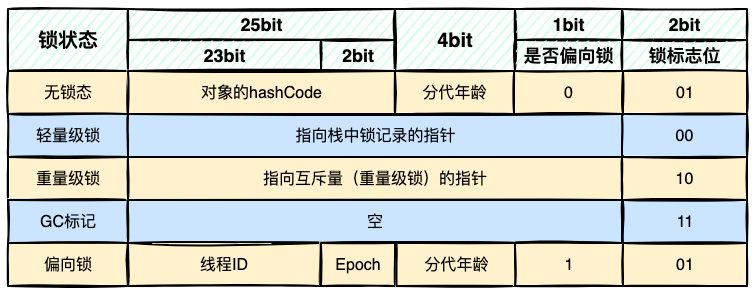

  - Synchronized 通常被称为重量级锁，它的早期设计并不包含锁升级机制，所以性能较差，那个时候只有无锁和有锁之分，但是1.6之后对其进行优化，为了减少获取锁和释放锁带来的性能消耗，新增了轻量级锁和偏向锁，所以需要重点关注这两种状态的原理，以及它们的区别

### 锁的四种状态

在Java 6中，锁一共被分为4种状态，级别由低到高依次是：无锁状态、偏向锁状态、轻量级锁状态、重量级锁状态。随着线程竞争情况的升级，锁的状态会从无锁状态逐步升级到重量级锁状态。锁可以升级却不能降级，这种只能升不能降的策略，是为了提高效率

从对象头的存储内容可以看出锁的状态都保存在对象头中，Synchronized也不例外，当其从轻量级锁膨胀为重量级锁时，锁标识位为10，其中指针指向的是 monitor对象（也称为管程或监视器锁）的起始地址。

关于Synchronized的实现在Java对象头里较为简单，只是改变一下标识位，并将指针指向 monitor对象的起始地址，其实现的重点是 monitor对象

### 代码方式梳理实现原理

参考代码如下：

```java
public class Demo {
  
  // 同步方法
  public synchronized void method1() {
    System.out.println("Hello, do method1.");
  }
  
  public void method2() {
    // 同步代码块
    synchronized (this) {
      System.out.println("Let's do method2.");
    }
  }
}
```

以上代码是Synchronized最常用的两种方式，下面执行 `javap -c -v` 命令进行反汇编，过滤掉其他无用信息，反汇编结果如下：

```java
public synchronized void method1();
		descriptor: ()V
    flags: ACC_PUBLIC, ACC_SYNCHRONIZED
    Code:
			stack=2, locals=1, args_size=1
        0: getstatic		  #2							// Field java/lang/System.out:Ljava/io/PrintStream;
        3: ldc					  #3							// String Hello, do method1.
        5: invokevirtual	#4							// Method java/io/PrintStream.println:(Ljava/lang/String;)V
        8: return
          
public void method2();
		descriptor: ()V
    flags: ACC_PLUBLIC
    Code:
			stack=2, locals=3, args_size=1
        0: aload_0
        1: dup
        2: astore_1
        3: monitorenter
        4: getstatic			#2							// Field java/lang/System.out:Ljava/io/PrintStream;
        7: ldc						#5							// String Let's do method2.
       	9: invokevirtual	#4							// Method java/io/PrintStream.println:(Ljava/lang/String;)V
       12: aload_1
       13: monitorexit
       14: goto						22
       17: astore_2
       18: aload_1
       19: monitorexit
       20: aload_2
       21: athrow
       22: return
```

根据上面反汇编结果可以看出，JVM对于同步方法和同步代码块的处理方式不同。

- 对于同步方法，JVM采用 `ACC_SYNCHRONIZED` 标记符来实现同步
- 对于同步代码块，JVM采用 `monitorenter` 和 `monitorexit` 这两个指令实现同步

#### ACC_SYNCHRONIZED 标识符

> 方法级的同步是隐式的。同步方法的常量池中会有一个 `ACC_SYNCHRONIZED` 标志。当某个线程要访问某个方法的时候，会检查是否有 `ACC_SYNCHRONIZED` 标志，如果有设置，则需要先获得监视器锁 monitor，然后开始执行方法，方法执行之后再释放监视器锁monitor。这时如果其他线程来请求执行方法，会因为无法获得监视器锁而被阻断住。值的注意的是，如果在方法执行过程中，发生了异常，并且方法内部并没有处理该异常，那么在异常被抛到方法外面之前监视器锁会被自动释放

#### monitorenter 和 monitorexit 指令

> 可以把执行 `monitorenter` 指令理解为加锁，执行 `monitorexit` 理解为释放锁。每个对象维护着一个记录被锁次数的计数器。未被锁定的对象的该计数器为0，当一个线程获得锁（执行 monitorenter）后，该计数器自增变为1，当同一个线程再次获得该对象的锁的时候，计数器再次自增。当同一个线程释放锁（执行 monitorexit）的时候，计数器再自减。当计数器为0的时候，锁将被释放，其他线程便可获得锁

但是上面的反汇编结果并不是仅有一个monitorexit指令，而是出现了两条monitorexit指令，这是为什么呢？

> 原因是这样的，编译器需要确保方法中调用过的每条monitorenter指令都要执行对应的monitorexit指令。为了保证在方法异常时，monitorenter和monitorexit指令也能正常配对执行，编译器会自动产生一个异常处理器，它的目的就是用来执行异常的monitorexit指令。而字节码中多出的monitorexit指令，就是异常结束时，被执行用来释放monitor的

### synchronized实现原理总结

1. synchronized同步代码块：synchronized关键字经过编译之后，会在同步代码块前后分别形成monitorenter和monitorexit字节码指令，在执行monitorenter指令的时候，首先尝试获取对象的锁，如果这个锁没有被锁定或者当前线程已经拥有了那个对象的锁，锁的计数器就加1，在执行monitorexit指令时会将锁的计数器减1，当减为0的时候就释放锁。如果获取对象锁一直失败，那当前线程就要阻塞等待，直到对象锁被另一个线程释放为止
2. 同步方法：方法级的同步是隐式的，无需通过字节码指令来控制，JVM可以从方法常量池的方法表结构中的ACC_SYNCHRONIZED访问标志得知一个方法是否声明为同步方法。当方法调用时，调用指令会检查方法的ACC_SYNCHRONIZED访问标志是否被设置，如果设置了，执行线程就要求先持有monitor对象，然后才能执行方法，最后当方法执行完（无论是正常完成还是非正常完成）时释放monitor对象。在方法执行期间，执行线程持有了管程，其他线程都无法再次获取同一个管程

monitorenter 和 monitorexit 指令是通过 monitor 对象实现的。

每个对象都有一个监视器锁（monitor）与之对应。当monitor被占用时就会处于锁定状态，线程执行monitorenter指令时尝试获取monitor的所有权，过程如下：

1. 如果monitor的进入数为0，则该线程进入monitor，然后将进入数设置为1，该线程即为monitor的所有者
2. 如果线程已经占用该monitor，只是重新进入，则进入monitor的进入数加1
3. 如果其他线程已经占用了monitor，则该线程进入阻塞状态，直到monitor的进入数为0，再重新尝试获取monitor的所有权

通过 monitorenter 和 monitorexit 两个指令可以清楚的看出synchronized的实现原理，==synchronized的语义底层是通过一个 monitor的对象来完成==，其实wait/notify等方法也依赖于monitor对象，这就是为什么只有在同步的块或者方法中才能调用wait/notify等方法，否则会抛出异常`java.lang.IllegalMonitorStateException`

### synchronized 是如何保证原子性、有效性和可见性的？

- 原子性：即一个操作或者多个操作，要么全部执行并且执行的过程不会被任何因素打断，要么就都不执行

  > Java内存模型提供了字节码指令 monitorenter 和 monitorexit 来隐式的使用这两个操作，在 synchronized 块之间的操作是具备原子性的。
  >
  > 
  >
  > 线程1在执行 monitorenter 指令的时候，会对 monitor进行加锁，加锁后其他线程无法获得锁，除非线程1主动解锁。即使在执行过程中，由于某种原因，比如CPU时间片用完，线程1放弃了CPU，但是它并没有进行解锁。而由于synchronized的锁是可重入的，下一个时间片还是只能被他自己获取到，还是会继续执行代码。直到所有代码执行完。这就保证了原子性

- 有序性：程序执行的顺序按照代码的先后顺序执行

  > 在并发时，程序的执行可能会出现乱序。给人的直观感觉就是：写在前面的代码，会在后面执行。但是synchronized提供了有序性保证，这其实和`as-if-serial`语义有关
  >
  > `as-if-serial` 语义是指不管怎么重排序（编译器和处理器为了提高并发度），单线程程序的执行结果都不能被改变。编译器的处理器无论如何优化，都必须遵守 `as-if-serial` 语义。只要编译器和处理器都遵守了这个语义，那么就可以认为单线程程序是按照顺序执行的，由于synchronized修饰的代码，同一时间只能被同一个线程访问。那么可以认为是单线程执行的。所以可以保证其有序性。但需要注意的是synchronized虽然能够保证有序性，但是无法禁止指令重排和处理器优化

- 可见性：当多个线程访问同一个变量时，一个线程修改了这个变量值，其他线程能够立即看到修改的值。被synchronized修饰的代码，在开始执行时会加锁，执行完成后会进行解锁，但在一个变量解锁之前，必须先把变量同步会主存中，这样解锁后，后续其他线程就可以访问到被修改后的值，从而保证可见性 

---

## CAS

> 在了解 Synchronized 锁升级过程之前，我们需要先了解 CAS 原理，为什么呢？因为 CAS 贯穿了整个 Synchronized 锁升级的过程

- CAS：compare and swap 或者 compare and exchange （比较交换）

当我们需要对内存中的数据进行修改操作时，为了避免多线程并发修改的情况，我们在对它进行修改操作前，先读取它原来的值 `E`，然后进行计算得出新的值 `V`，在修改前去比较当前内存中的值 `N` 是否和我们之前读取到的值 `E` 相同。如果相同，则认为其他线程没有修改过内存中的值；如果不相同，则说明被其他线程修改了，这时，要继续循环去获取最新的值 `E`，再进行计算和比较，直到我们预期的值和当前内存中的值相等时，再对数据执行修改操作

### CAS 具体流程图

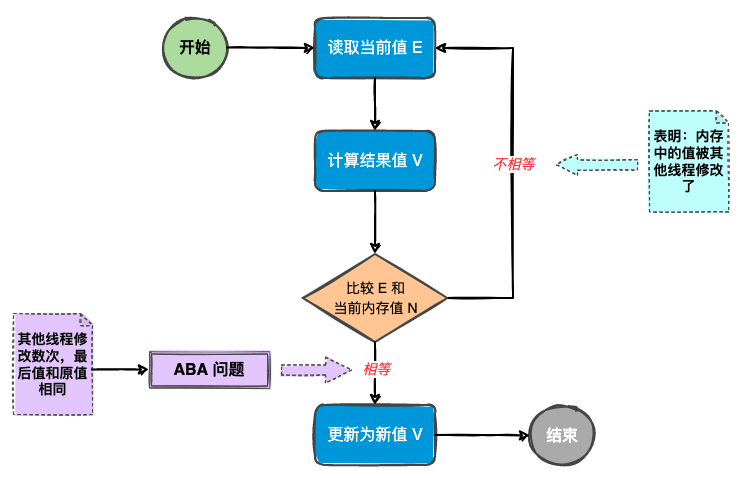

CAS 是为了实现 Java 中的原子操作而出现的。为了保证在比较完成后赋值这两个操作的原子性，JVM 内部实现 CAS 操作时通过 LOCK CMPXCHG 指令锁 CPU 总线方式实现原子操作

---

## Java 对象头

> Synchronized 用的锁是存在 Java 对象头里的

### 32位 Java 对象头结构

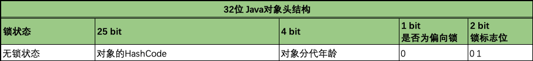

### 64位 Java 对象头结构

> 对于 64位的 Java对象头，其余信息基本不变，只是中间有关于对象 HashCode值和之后加锁信息的位数加大以外，其他基本不变。
>
> 64位虚拟机系统下 Java对象头在不同锁状态下的变化如下表所示：

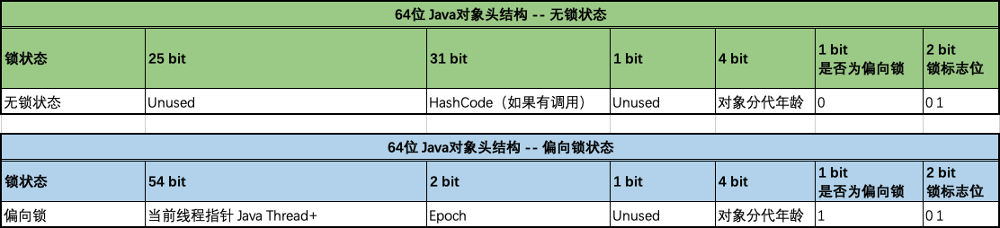

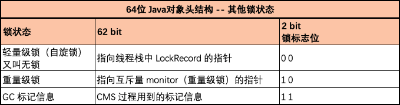

上表中，最后两位代表是否加锁的标志位。

- 锁标志位如果是 `01` 的话，需要根据前一位的是否为偏向锁来判断当前的锁状态。如果前一位为 `0` ，则代表无锁状态；如果为 `1` 则代表有偏向锁
- 锁标志位说明
  - `00`：代表轻量级锁
  - `01`：需要结合前一位是否为偏向锁来决定。如果前一位为 `0`，则表示无锁状态；如果前一位为 `1`，则表示偏向锁
  - `10`：代表重量级锁
  - `11`：代表GC垃圾回收的标记信息

---

## Synchronized 锁升级

### 【思考 :thinking: 】为什么会有 <b style="color:#ff0000">锁升级</b> 的过程呢 ？

- 在 Java6 以前 Synchronized 锁实现都是重量级锁的形式，效率低下。为了提升效率，对锁进行了优化处理，所以出现了锁升级的过程。

### 我们通常说的 Synchronized 锁是重量级锁，那么为什么叫它重量级锁 ？

- 因为 Synchronized 执行 <b style="color:#0000ff">效率太低</b>。在 Java6 以前 <b style="color:#0000ff">每次调用 Synchronized 加锁时都需要进行系统调用，系统调用会涉及到用户态和内核态的切换，系统调用会经过 0x80 中断，经过内核调用后再返回用户态。此过程比较复杂，时间比较长，所以通常叫 Synchronized 为重量级锁</b>。
- 【误区 :x: 】<b style="color:#ff0000">其实锁升级过程中涉及到的偏向锁，轻量级锁等，都是 Synchronized 锁的具体实现所要经历的过程，他们并不是单独的锁。只是给它们这几种锁的状态起了一个名字而已</b>。

### Synchronized 锁的四种状态

- 无锁
- 偏向锁
- 轻量级锁
- 重量级锁

这四种状态会随着竞争状态逐渐升级，锁可以升级但不能降级，但是偏向锁状态可以被重置为无锁状态。

### 锁升级演变过程

> 锁升级过程，主要是对象头 MarkWord 状态位的变化

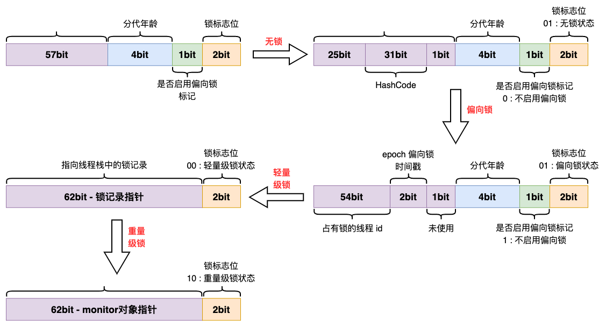

- 无锁：锁对象刚创建的时候，处于无锁状态，是否为偏向锁标志位为 `0`，锁标志位为 `01`
- 偏向锁：线程获取到该锁，此时是否为偏向锁标志位为 `1`，锁标志位为 `01`。左边54位记录线程id，当锁处于偏向锁的时候。如果有另一个线程试图获取锁，则偏向锁就会升级为轻量级锁
  - 偏向锁撤销条件
    1. 多个线程抢夺锁资源，导致锁升级
    2. 调用锁对象的 HashCode 方法或者 System.identityHashCode() 方法
- 轻量级锁：多个线程抢夺锁资源，锁标志位为 `00`，当线程自旋多次之后，仍然无法获取到锁资源，锁对象就会升级为重量级锁。持有锁的线程会在栈帧中创建一个 Lock Record 区域，用来存储 MarkWord 对象信息
- 重量级锁：锁标志为 `10`，采用系统内核的互斥锁实现

---

## 偏向锁

### 偏向锁产生原因 ？？？

- 大多数情况下，锁不仅不存在多线程竞争，而且<u>总是由同一线程多次获得</u>，<b style="color:#00aa00">为了让线程获得锁的代价更低而引入了偏向锁</b>。

### 获取偏向锁的流程

当一个线程访问同步块时，会先判断锁标志为是否为 `01`，如果是 `01`，则判断是否为偏向锁，如果是，会先判断当前锁对象头中是否存储了当前的线程 `id`，如果存储了，则直接获的锁。如果对象头中指向不是当前线程 `id`，则通过 CAS 尝试将自己的线程 `id` 存储进当前锁对象的对象头中来获取偏向锁。当 CAS 尝试获取偏向锁成功后，则继续执行同步代码块，否则等待安全点的到来撤销原来线程的偏向锁，撤销时需要暂停原持有偏向锁的线程，判断线程是否活动状态，如果已经退出同步代码块，则唤醒新的线程开始获取偏向锁，否则开始锁竞争，进行锁升级过程，升级为轻量级锁。

### 偏向锁获取流程图解

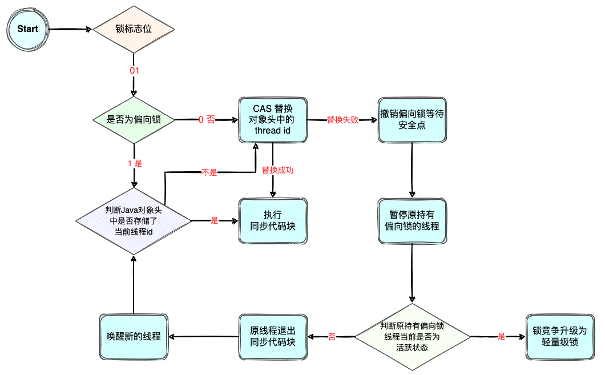

> 【注 :warning: 】<b style="color:#ff0000">在高并发下可以关闭偏向锁来提升性能</b>，通过设置 JVM 参数：`-XX:-UseBiasedLocking=false`

---

## 轻量级锁

> 当出现锁竞争时，偏向锁会升级为轻量级锁

在升级轻量级锁之前，JVM 会先在当前线程的栈帧中创建用于存储锁记录的空间，即将对象头中用来标记锁信息相关的内容封装成一个 Java 对象，放入当前线程的栈帧中，这个对象称为 LockRecord，然后线程尝试通过 CAS 将对象头中 mark work 替换为指向锁记录（LockRecord）的指针。如果成功，则当前线程获取锁；如果失败，则使用自旋来获取锁。

自旋其实就是不断的循环进行 CAS 操作，直到能成功替换。所以轻量级锁又叫自旋锁。

### 栈上分配Lock Record

> Lock Record 中包含了对象的引用地址 Object reference

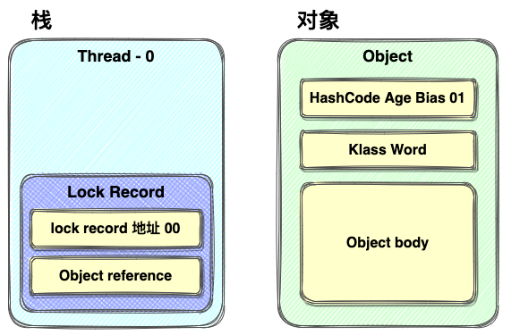

### 对象头Mark Word替换

> 对象头中Mark Word替换锁记录指针

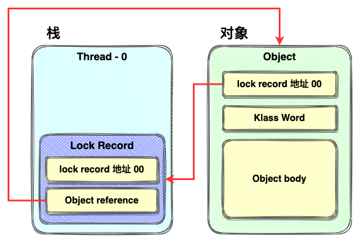

- 替换成功之后，将锁标志位改为 00，表示获取轻量级锁成功

### 轻量级锁重入

- Lock Record 的作用：在这里实现了锁重入，每当同一个线程多次获取同一个锁时，会在当前栈帧中放入一个 Lock Record，但是重入是放入的 Lock Record 关于锁信息的内容为 null，代表锁重入。
- 当轻量级解锁时，每解锁一次则从栈帧中弹出一个 Lock Record，直到为 0。

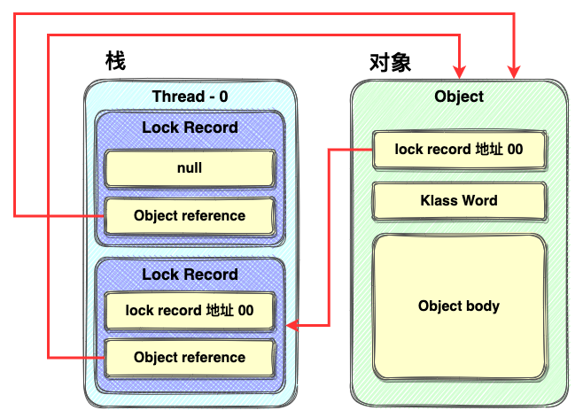

- 当通过 CAS 自旋获取轻量级锁达到一定次数时，JVM 会发生锁膨胀，从而升级为重量级锁
  - 原因：不断的自旋，在高并发下会消耗大量的 CPU 资源，所以 JVM 为了节省 CPU 资源，进行了锁升级。将等待获取锁的线程都放入了一个等待队列中来节省 CPU 资源。

## 重量级锁

> 当自旋达到一定次数时，轻量级锁会升级为重量级锁

在重量级锁中，将 Lock Record 对象替换成了 monitor 对象的实现。主要通过 monitorenter 和 monitorexit 两个指令来实现。需要经过系统调用，在并发低的情况下效率会低。

[通过 openJDK 可以查看 ObjectMonitor 对象的结构](http://hg.openjdk.java.net/jdk8/jdk8/hotspot/file/9758d9f36299/src/share/vm/runtime/objectMonitor.hpp)

```java
ObjectMonitor() {
    _header       = NULL;
    _count        = 0;					// monitor 对象中的计数器，每获取一次锁时，累计1；每退出一次锁时，累减1，直到减为0，则锁完全退出
    _waiters      = 0,
    _recursions   = 0;
    _object       = NULL;
    _owner        = NULL;				// 拥有当前对象的线程
    _WaitSet      = NULL;				// 阻塞队列
    _WaitSetLock  = 0 ;
    _Responsible  = NULL ;
    _succ         = NULL ;
    _cxq          = NULL ;
    FreeNext      = NULL ;
    _EntryList    = NULL ;			// 有资格成为候选资源的线程队列
    _SpinFreq     = 0 ;
    _SpinClock    = 0 ;
    OwnerIsThread = 0 ;
    _previous_owner_tid = 0;
}
```

### 使用 monitor 加锁

- 重量级锁在进行锁重入的时候，每获取到锁一次，会对 monitor 对象中的计数器 `+1`，等锁退出时，则会相应的 `-1`，直到减到 `0` 为止，锁完全退出。

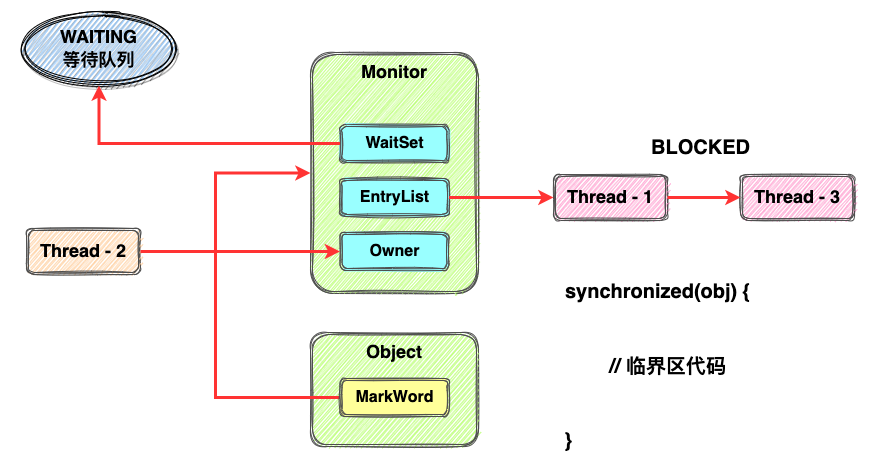

## 3种锁状态优缺点对比

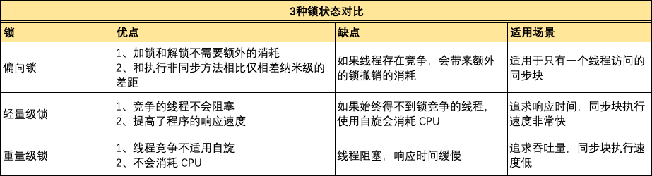

- 偏向锁、轻量级锁（又称自旋锁或无锁）、重量级锁，都是 synchronized 锁实现中锁经历的几种不同的状态。三种锁状态的场景总结如下：
  - 只有一个线程进入临界区 —— 偏向锁
  - 多个线程交替进入临界区 —— 轻量级锁
  - 多个线程同时进入临界区 —— 重量级锁

