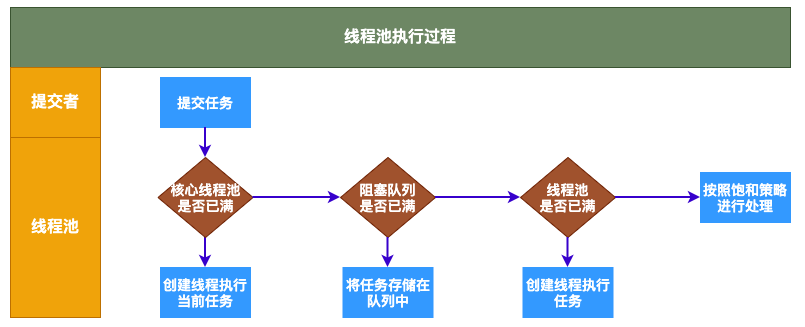
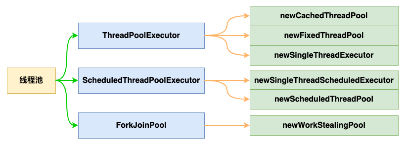
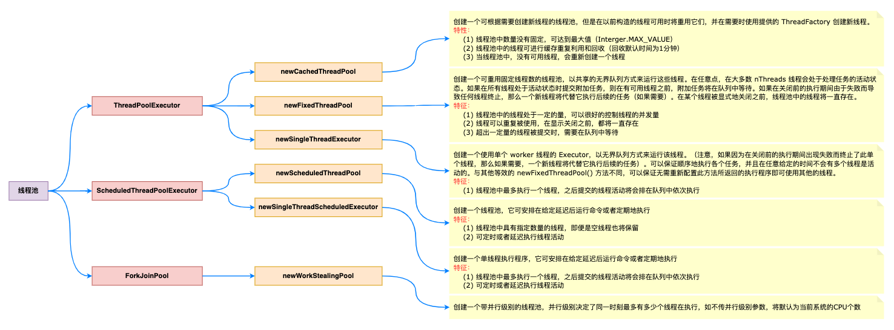
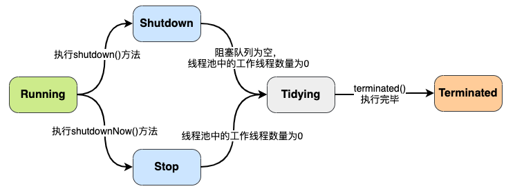
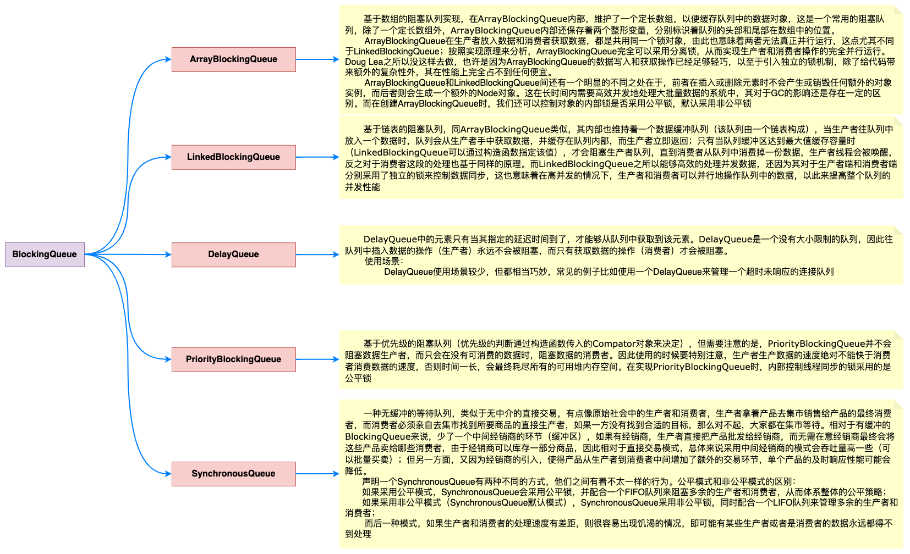
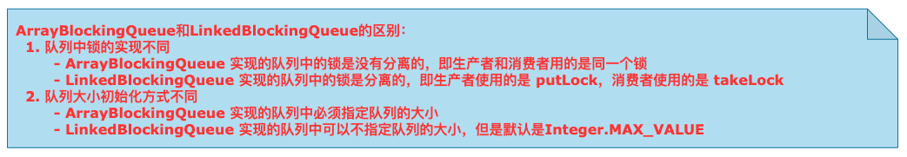
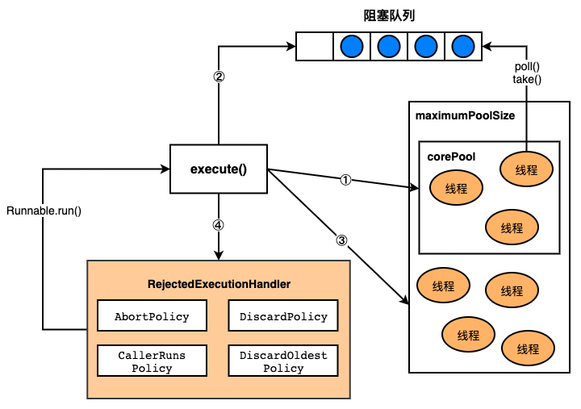

[TOC]

# 🐱 [基础] Java 线程池

## 🤔思考：为什么需要线程池？？？

​		在实际使用中，线程是很占用系统资源的，如果对线程管理不善很容易导致系统问题。因此，在大多数并发框架中都会使用线程池来管理线程。

## 线程池管理线程的好处

1. 使用线程池可以重复利用已有的线程继续执行任务，避免线程在创建和销毁时造成的消耗
2. 由于没有线程创建和销毁时的消耗，可以提高系统响应速度
3. 通过线程池可以对线程进行合理的管理，根据系统的承受能力调整可运行线程数量的大小等

## 线程池工作原理



- 线程池执行所提交的任务过程：
  1. 先判断线程池中核心线程池所有的线程是否都在执行任务。如果不是，则新创建一个线程执行刚提交的任务；否则，核心线程池中所有的线程都在执行任务，进入第2步
  2. 判断当前阻塞队列是否已满，如果未满，则将提交的任务放置在阻塞队列中；否则，进入第3步
  3. 判断线程池中所有的线程是否都在执行任务，如果没有，则创建一个新的线程来执行任务；否则，交给饱和策略（又称，拒绝策略）进行处理

## 线程池的分类



- ThreadPoolExecutor：线程池执行器
- ScheduledThreadPoolExecutor：可调度的线程池执行器
- ForkJoinPool：JDK1.7以后出现的新的线程池，`分而治之`思想



##  线程池的生命周期

> *谨记，区分线程的生命周期与线程池的生命周期，两者之间不要混淆*



> Shutdown、Stop、Tidying 均属于线程池生命周期的中间过渡状态。
>
> 线程池生命周期主要的状态就是Running、Terminated状态

- **Running**：能够接受新提交的任务，并且也能处理阻塞队列中的任务
- **Shutdown**：关闭状态，不再接受新提交的任务，但却可以继续处理阻塞队列中已保存的任务
- **Stop**：不能接受新任务，也不处理队列中的任务，会中断正在处理任务的线程。***<u>太暴力了</u>***
- **Tidying**：如果所有的任务都已终止，workerCount（有效线程数）为0，线程池进入该状态后会调用terminated() 方法进入Terminated状态
- **Terminated**：在terminated()方法执行完后进入该状态，默认terminated()方法中什么也没有做

## 线程池的创建

> **注意：牢记并掌握各个参数的具体含义**

- ThreadPoolExecutor 类的构造器

  ```java
  public ThreadPoolExector(int corePoolSize,
                           int maximumPoolSize,
                           long keepAliveTime,
                           TimeUnit unit,
                           BlockingQueue<Runnable> workQueue,
                           ThreadFactory threadFactory,
                           RejectedExecutorHandler handler) {
    // ... ...
  }
  ```

  - 参数说明
    - `corePoolSize`：核心线程池的大小
    - `maximumPoolSize`：线程池能创建线程的最大个数
    - `keepAliveTime`：空闲线程存活时间（针对多于核心线程个数的线程来说的）
    - `unit`：时间单位，为keepAliveTime指定时间单位
    - `workQueue`：阻塞队列，用于保存任务的阻塞队列
    - `threadFactory`：创建线程的工程类
    - `handler`：饱和策略（拒绝策略）

## 阻塞队列

1. ArrayBlockingQueue
2. LinkedBlockingQueue
3. DelayQueue
4. PriorityBlockingQueue
5. SynchronousQueue



> *ArrayBlockingQueue 和 LinkedBlockingQueue 之间的区别*



## 拒绝策略

- `ThreadPoolExecutor.AbortPolicy`：丢弃任务并抛出 RejectedExecutionException异常
- `ThreadPoolExecutor.DiscardPolicy`：也是丢弃任务，但是不抛出异常
- `ThreadPoolExecutor.DiscardOldestPolicy`：丢弃队列最前面的任务，然后重新尝试执行任务（重复此过程）
- `ThreadPoolExecutor.CallerRunsPolicy`：由调用线程处理该任务

## execute 方法执行逻辑



- 如果当前运行的线程少于`corePoolSize`，则会创建新的线程来执行新的任务
- 如果运行的线程个数等于或者大于`corePoolSize`，则会将提交的任务存放到阻塞队列`workQueue`中
- 如果当前`workQueue`队列已满的话，则会创建新的线程来执行任务
- 如果线程个数已经超过了`maximumPoolSize`，则会使用饱和策略`RejectedExecutionHandler`来进行处理

## executor 和 submit

- submit 是基于方法Executor.execute(Runnable)的延伸，通过创建并返回一个Future类对象可用于取消执行和/或等待完成。

## 线程池的关闭

- 关闭线程池，可通过`shutdown`和`shutdownNow`两个方法
- 原理：遍历线程池中的所有线程，然后依次中断
  1. `shutdownNow` 首先将线程池的状态置为 STOP，然后尝试停止所有正在执行和未执行任务的线程，并返回等待执行任务的列表
  2. `shutdown` 只是将线程池的状态设置为 SHUTDOWN 状态，然后中断所有没有正在执行任务的线程