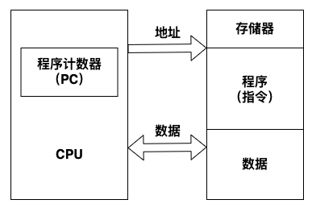
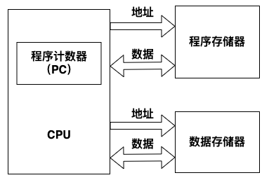
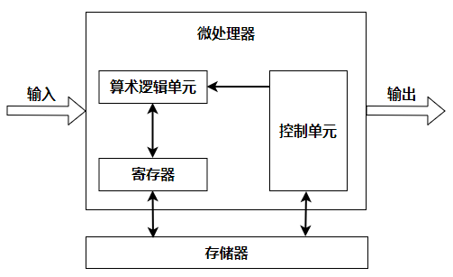
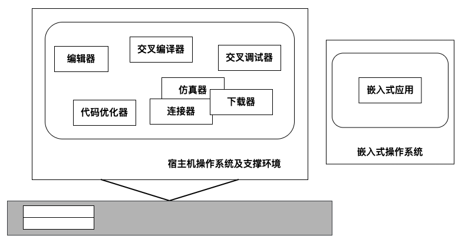

[TOC]

# 【05】嵌入式技术

> 内容大纲
>
> - 嵌入式微处理器体系结构
>   - 微处理器分类
>   - 多核处理器
> - 嵌入式软件与操作系统
>   - 嵌入式软件
>   - 嵌入式操作系统
>   - 嵌入式实时操作系统
> - 嵌入式软件设计
>   - 软件开发流程
>   - 软件开发工具

## 嵌入式微处理器体系结构

### 冯诺依曼结构

- 传统计算机采用冯·诺依曼（Von Neumann）结构，也称普林斯顿结构，是一种将程序指令存储器和数据存储器合并在一起的存储器结构
- 冯诺依曼结构的计算机程序和数据共用一个存储空间，程序指令存储地址和数据存储地址指向同一个存储器的不同物理位置
- 处理器执行指令时，先从存储器中取出指令解码，再取操作数执行运算，即使单条指令也要耗时几个甚至几十个周期，在高速运算时，在传输通道上会出现瓶颈效应

### 哈佛结构

- 哈佛结构是一种并行体系结构，它的主要特点是将程序和数据存储在不同的存储空间中，即程序存储器和数据存储器是两个相互独立的存储器，每个存储器独立编址、独立访问。
- 与两个存储器相对应的是系统中的两套独立的地址总线和数据总线
- 这种分离的程序总线和数据总线可允许在一个机器周期内同时获取指令字（来自程序存储器）和操作数（来自数据存储器），从而提高了执行速度，使数据的吞吐率提高了1倍
- 但这不意味着可以在一个机器周期内多次访问存储器

## 嵌入式微处理器分类

嵌入式硬件系统基本结构如下图所示，一般由嵌入式微处理器、存储器、输入/输出部分组成。其中，嵌入式微处理器是嵌入式硬件系统的核心，通常由3大部分组成：

- 控制单元（控制器）
- 算术逻辑单元（运算器）
- 寄存器

### 分类方式

- 根据嵌入式微处理器的字长宽度，可分为4位、8位、16位、32位和64位。一般把16位及以下的称为嵌入式微控制器（Embedded Micro Controller），32位及以上的称为嵌入式微处理器
- 根据系统集成度划分，可以分为两类：
  - 微处理器内部仅包含单纯的中央处理单元，称为一般用途微处理器
  - 将CPU、ROM、RAM及 I/O等部件集成到同一个芯片上，称为单芯片微控制器（Single Chip Microcontroller）
- 根据用途分类，一般可分为嵌入式微控制器`MCU`、嵌入式微处理器`MPU`、嵌入式数字信号处理器`DSP`、嵌入式片上系统`SOC`等

### 处理器各用途说明

- 嵌入式微控制器`MCU`的典型代表是单片机（8051、8052），其片上外设资源比较丰富，适合于控制
  - `MCU`芯片内部集成ROM/EPROM、RAM、总线、总线逻辑、定时/计数器、看门狗、I/O 串行口、脉宽调制输出、A/D（模数转换）、D/A（数模转换）、Flash RAM、EEPROM等各种必要功能和外设
  - 和嵌入式微处理器相比，微控制器的最大特点是单片化，体积大大减小，从而使功耗和成本下降、可靠性提高，其片上外设资源一般较丰富，适合于控制，是嵌入式系统工业的主流
- 嵌入式微处理器`MPU`由通用计算机中的CPU演变而来
  - 特征：具有32位以上的处理器，具有较高的性能，当然其价格也相应较高
  - 与计算机处理器不同的是，在实际嵌入式应用中，只保留和嵌入式应用紧密相关的功能硬件，去除其他的冗余功能部分，这样就以最低的功耗和资源实现嵌入式应用的特殊要求
  - 与工业控制计算机相比，嵌入式微处理器具有体积小、重量轻、成本低、可靠性高的有点
  - 目前常见的有ARM、MIPS、POWER PC等
- 嵌入式数字信号处理器`DSP`是专门用于信号处理方面的处理器，其在系统结构和指令算法方面进行了特殊设计，具有很高的编译效率和指令的执行速度
  - 采用哈佛结构，流水线处理，其处理速度比最快的CPU还快10~50倍
  - 在数字滤波、FFT、谱分析等各种仪器上DSP获得了大规模的应用
  - DSP特点：
    - 多总线结构，允许CPU同时进行指令和数据的访问，因此可以实现流水线操作
    - 哈佛体系结构，程序和数据空间分开，可以同时访问指令和数据
    - 数字信号处理的运算特点：乘/加，及反复相乘求和（乘积累加）
    - DSP设置了硬件乘法/累加器，能在单个指令周期内完成乘法/加法运算
  - DSP主要应用：
    - 信号处理、图像处理、仪器、语言处理、控制、军事、通讯、医疗、家用电器等领域
- 嵌入式片上系统`SOC`，是追求产品系统最大包容的集成器件
  - `SOC`最大的特点是成功实现了软硬件无缝结合，直接在处理器片内嵌入操作系统的代码模块
  - 是一个有专用目标的集成电路，其中包含完整系统并有嵌入软件的全部内容

### 多核处理器结构

- 多核指多个微处理器内核，是将两个或更多的微处理器封装在一起，集成在一个电路中
- 多核处理器是单枚芯片，能够直接插入单一的处理器插槽中
- 多核与多CPU相比，很好的降低了计算机系统的功耗和体积。在多核技术中，由操作系统软件进行调度，多进程，多线程并发都可以
- 多核处理器：基于单个半导体的一个处理器上拥有2个处理器核心
- 多核处理器优势：
  - 由于将2个或多个运算核封装在一个芯片上，节省大量晶体管、封装成本；显著提高了处理器性能；兼容性好；系统升级方便
- 2个或多个内核工作协调实现方式：
  - 对称多处理技术：将2颗完全一样的处理器封装在一个芯片内，达到双倍或接近双倍的处理性能，节省运算资源
  - 非对称处理技术：2个处理内核彼此不同，各自处理和执行特定的功能，在软件的协调下分担不同的计算任务
  - 从目前已经发布或透露的多核处理器原型来看，对称式的处理方式将成为未来多核处理器的主要体系结构，同时，多核间将共享大容量的缓存作为处理器之间及处理器与系统内存之间交换数据的"桥梁"
  - 为了提高交换速度，这些缓存往往集成在片内，其数据传输速度是惊人的
- 多核CPU的调度
  - 多核CPU环境下进程的调度算法一般有全局队列调度和局部队列调度两种
  - 全局队列调度是指操作系统维护一个全局的任务等待队列，当系统中有一个CPU空闲时，操作系统就从全局任务等待队列中选取就绪任务开始执行，CPU核心利用率高
  - 局部队列调度是指操作系统为每个CPU内核维护一个局部的任务等待队列，当系统中有一个CPU内核空闲时，就从该核心的任务等待队列中选取适当的任务执行，优点是无需在多个CPU之间切换

## 嵌入式软件

​	嵌入式软件是指应用在嵌入式计算机系统当中的各种软件，除了具有通用软件的一般特性，还具有一些与嵌入式系统相关的特点，包括：规模较小、开发难度大、实时性和可靠性要求高、要求固化存储

### 嵌入式软件分类

- 系统软件。控制和管理嵌入式系统资源，为嵌入式应用提供支持的各种软件，如设备驱动程序、嵌入式操作系统、嵌入式中间件等
- 应用软件。嵌入式系统中的上层软件，定义了嵌入式设备的主要功能和用途，并负责与用户交互，一般面向特定的应用领域，如飞行控制软件、手机软件、地图等
- 支撑软件。辅助软件开发的工具软件，如系统分析设计工具、在线仿真工具、交叉编译器等

### 设备驱动层

​	又称为板级支持包`BSP`，包含了嵌入式系统中所有与硬件相关的代码，直接与硬件打交道，对硬件进行管理和控制，并为上层软件提供所需的驱动支持

​	板级支持包`BSP`，是介于主板硬件和操作系统中驱动层程序之间的一层，一般认为它属于操作系统的一部分，主要是实现对操作系统的支持，为上层的驱动程序提供访问硬件设备寄存器的函数包，使之能够更好的运行与硬件主板

​	在嵌入式系统软件的组成中，就有BSP。BSP是相对操作系统而言的

​	不同的操作系统对应于不同定义形式的BSP。例如，VxWorks的BSP和Linux的BSP相对于某一CPU来说尽管实现的功能一样，可是写法和接口定义是完全不同的

​	所以写BSP一定要按照该系统的BSP的定义形式来写（BSP的编程过程大多数是在某一个成型的BSP模板上进行修改）

​	这样才能与上层OS保持正确的接口，良好的支持上层OS

- BSP主要功能为屏蔽硬件，提供操作系统及硬件驱动，具体功能包括：
  - 单版硬件初始化，主要是CPU的初始化，为整个软件系统提供底层硬件支持
  - 为操作系统提供设备驱动程序和系统中断服务程序
  - 定制操作系统的功能，为软件系统提供一个实时多任务的运行环境
  - 初始化操作系统，为操作系统的正常运行做好准备
- 板级支持包（BSP，也称为硬件抽象层HAL），一般包含相关底层硬件的初始化、数据的输入/输出操作和硬件设备的配置等功能，它主要具有以下两个特点
  - 硬件相关性。因为嵌入式实时系统的硬件环境具有应用相关性，而作为上层软件与硬件平台之间的接口，BSP需为操作系统提供操作和控制具体硬件的方法
  - 操作系统相关性。不同的操作系统具有各自的软件层次结构，因此不同操作系统具有特定的硬件接口形式
- 一般来说，BSP主要包含两个方面的内容：引导加载程序BootLoader和设备驱动程序

#### 引导加载程序

- BootLoader是嵌入式系统加电后运行的第一段软件代码，是在操作系统内核运行之前运行的一小段程序，通过这段程序，可以初始化硬件设备、建立内存空间的映射图，从而将系统的软硬件环境设置到一个合适的状态，以便为最终调用操作系统内核做好准备。一般包括以下功能：
  - 片级初始化。主要完成微处理器的初始化，包括设置微处理器的核心寄存器和控制寄存器、微处理器的核心工作模式及其局部总线模式等。片级初始化把微处理器从上电时的默认状态逐步设置成系统所要求的工作状态。这是一个纯硬件的初始化过程
  - 板级初始化。通过正确地设置各种寄存器的内容来完成微处理器以外的其他硬件设备的初始化。例如。初始化LED显示设备、初始化定时器、设置中断控制寄存器、初始化串口通信、初始化内存控制器、建立内存空间的地址映射等。在此过程中，除了要设置各种硬件寄存器以外，还要设备某种软件的数据结构和参数。因此，这是一个同时包含软件和硬件在内的初始化过程
  - 加载内核（系统级初始化）。将操作系统和应用程序的映像从Flash存储器复制到系统的内存当中，然后跳转到系统内核的第一条指令处继续执行

#### 设备驱动程序

​		在一个嵌入式系统当中，操作系统是可能有也可能无的。但无论如何，设备驱动程序是必不可少的。所谓的设备驱动程序，就是一组库函数，用来对硬件进行初始化和管理，并向上层软件提供良好的访问接口

​		对于不同的硬件设备来说，它们的功能是不一样的，所以它们的设备驱动程序也是不一样的。但是一般来说，大多数的设备驱动程序都会具备以下的一些基本功能：

- 硬件启动。在开机上电或系统重启的时候，对硬件进行初始化
- 硬件关闭。将硬件设置为关机状态
- 硬件停用。暂停使用这个硬件
- 硬件启用。重新启用这个硬件
- 读操作。从硬件中读取数据
- 写操作。往硬件中写入数据

### 嵌入式操作系统

- `EOS（Embedded Operating System）`，是指用于嵌入式系统的操作系统
- 嵌入式操作系统是一种用途广泛的系统软件，通常包括与硬件相关的底层驱动软件、系统内核、设备驱动接口、通信协议、图形界面、标准化浏览器等
- 嵌入式操作系统负责嵌入式系统的全部软、硬件资源的分配、任务调度，控制、协调并发活动。它必须体现其所在系统的特征，能够通过装卸某些模块来达到系统所要求的功能
- 目前在嵌入式领域广泛使用的操作系统有：嵌入式实时操作系统`µC/OS-Ⅱ`、嵌入式Linux、Windows Embedded、VxWorks等，以及应用在智能手机和平板电脑的Android、IOS等
- 嵌入式操作系统的特点：
  - 系统内核小。由于嵌入式系统一般是应用于小型电子装置，系统资源相对有限，所以内核较之传统的操作系统要小得多
  - 专用性强。嵌入式系统的个性化很强，其中软件系统和硬件的结合非常紧密，一般要针对硬件进行系统的移植，即使在同一品牌、同一系列的产品中也需要根据系统硬件的变化和增减不断进行修改。同时针对不同的任务，往往需要对系统进行较大更改，程序的编译下载要和系统相结合，这种修改和通用软件的"升级"是完全两个概念
  - 系统精简。嵌入式系统一般没有系统软件和应用软件的明显区分，不要求其功能设计及实现上过于复杂，这样一方面利于控制系统成本，同时也利于实现系统安全
  - 高实时性。高实时性的系统软件是嵌入式软件的基本要求，而且软件要求固态存储，以提高速度；软件代码要求高质量和高可靠性
  - 多任务的操作系统。嵌入式软件开发需要使用多任务的操作系统。嵌入式系统的应用程序可以没有操作系统直接在芯片上运行。但是为了合理地调度多任务、利用系统资源、系统函数以及和专用库函数接口，用户必须自行选配操作系统开发平台，这样才能保证程序执行的实时性、可靠性，并减少开发时间，保障软件质量

### 嵌入式实时操作系统

- 嵌入式实时操作系统是一种完全嵌入受控器件内部，为特定应用而设计的专用计算机系统。在嵌入式实时操作系统中，要求系统在投入运行前，即具有确定性和可预测性
  - 可预测性是指系统在运行之前，其功能、响应特性和执行结果是可预测的
  - 确定性是指系统在给定的初始化状态和输入条件下，在确定的时间内给出确定的结果
- 对嵌入式实时操作系统失效的判断，不仅依赖其运行结果的数值是否正确，也依赖提供结果是否及时

- 实时操作系统 **`RTOS`** 的特点：
  - 当外界事件或数据产生时，能够接受并以足够快的速度予以处理，其处理的结果又能在规定的时间之内来控制生产过程或对处理系统做出快速响应，并控制所有实时任务协调一致运行
  - 因而，提供及时响应和高可靠性是其主要特点
- 实时操作系统有硬实时和软实时之分：
  - 硬实时。要求在规定的时间内必须完成操作，这是在操作系统设计时保证的
  - 软实时。只要按照任务的优先级，尽可能块地完成操作即可
- 实时操作系统的特征：
  - 高精度计时系统
    - 计时精度是影响实时性的一个重要因素
    - 在实时应用系统中，经常需要精确实时地操作某个设备或执行某个任务，或精确的计算一个时间函数
    - 这些不仅依赖于一些硬件提供的时钟进度，也依赖于实时操作系统实现的高精度计时功能
  - 多级中断机制
    - 一个实时应用系统通常需要处理多种外部信息或事件，但处理的紧迫程度有轻重缓急之分。有的必须立即作出反应，有的则可以延后处理
    - 因此，需要建立多级中断嵌套处理机制，以确保对紧迫程度较高的实时事件进行及时响应和处理
  - 实时调度机制
    - 实时操作系统不仅要及时响应实时事件中断，同时也要及时调度运行实时任务
    - 但是，处理机调度并不能随心所欲的进行，因为涉及到两个进程之间的切换，只能在确保"安全切换"的时间点上进行
    - 实时调度机制包括两个方面：
      - 一是在调度策略和算法上，保证优先调度实时任务
      - 二是建立更多"安全切换"时间点，保证及时调度实时任务

> 实际上来看，实时操作系统如图操作系统一样，就是一个后台的支撑程序，可以按照实时性的要求进行配置、裁剪等
>
> ==**其关注的重点在于任务完成的时间是否能够满足要求**==

## 嵌入式软件设计

> 宿主机、目标机

​		嵌入式软件开发不同于传统软件开发，其所使用的开发环境、工具都有特殊性，在嵌入式软件开发中，一般使用宿主机和目标机的模式进行系统开发，并且借助于开发工具进行目标开发

- 交叉编译
  - 嵌入式软件开发所采用的编译为交叉编译
  - 所谓交叉编译就是在一个平台上生成可以在另一个平台上执行的代码
  - 编译的最主要的工作就在将程序转化成运行该程序的CPU所能识别的机器代码，由于不同的体系结构有不同的指令系统。因此，不同的CPU需要有相应的编译器，而交叉编译就如同翻译一样，把相同的程序代码翻译成不同CPU的对应可执行二进制文件
  - 由于一般通用计算机拥有非常丰富的系统资源、使用方便的集成开发环境和调试工具等，而嵌入式系统的系统资源非常紧缺，无法在其上运行相关的编译工具，因此，嵌入式系统的开发需要借助宿主机（通用计算机）来编译出目标机的可执行代码
- 交叉调试
  - 嵌入式软件经过编译和链接后即进入调试阶段，调试是软件开发过程中必不可少的一个环节，嵌入式软件开发过程中的交叉调试与通用软件开发过程中的调试方式有很大的差别
  - 在常见软件开发中，调试器与被调试的程序往往运行在同一台机计算机上，调试器是一个单独运行着的进程，它通过操作系统提供的调试接口来控制被调试的进程
  - 而在嵌入式软件开发中，调试时采用的是在宿主机和目标机之间进行的交叉调试，调试器仍然运行在宿主机的通用操作系统之上，但被调试的进程却是运行在基于特定硬件平台的嵌入式操作系统中
  - 调试器和被调试进程通过串口或者网络进行通信，调试器可以控制、访问被调试进程，读取被调试进程的当前状态，并能够改变被调试进程的运行状态

### 开发工具

- 嵌入式软件的开发可以分为几个阶段：编码、交叉编译、交叉调试。各个阶段工具如下：
  - 编辑器。用于编写嵌入式源代码程序，从理论上来说，任何一个文本编译器都可以用来编写源代码
    - 各种集成开发环境会提供功能强大的编辑器，如VS系列、eclipse、keil、css等。
    - 常见的独立编辑器：UE、Source Insight、vim等
  - 编译器gcc。编译阶段的工作是用交叉编译工具处理源代码，生成可执行的目标文件，在嵌入式系统中，由于宿主机和目标机系统不一样，需要使用交叉编译，GNU C/C++（gcc）是目前常用的一种交叉编译器，支持非常多的宿主机/目标机组合
    - gcc是一个功能强大的工具集合，包含了预处理器、编译器、汇编器、连接器等组件，会在需要时去调用这些组件来完成编译任务
  - 调试器gdb。在开发嵌入式软件时，交叉调试是必不可少的一步。嵌入式软件调试特点：
    - 调试器运行在宿主机上，被调试程序运行在目标机上
    - 调试器通过某种通信方式与目标机建立联系，如串口、并口、网络、JTAG等
    - 在目标机上一般有调试器的某种代理，能配合调试器一起完成对目标机上运行程序的调试，可以是软件或支持调试的硬件
    - gdb是GNU开源组织发布的一个强大的程序调试工具
