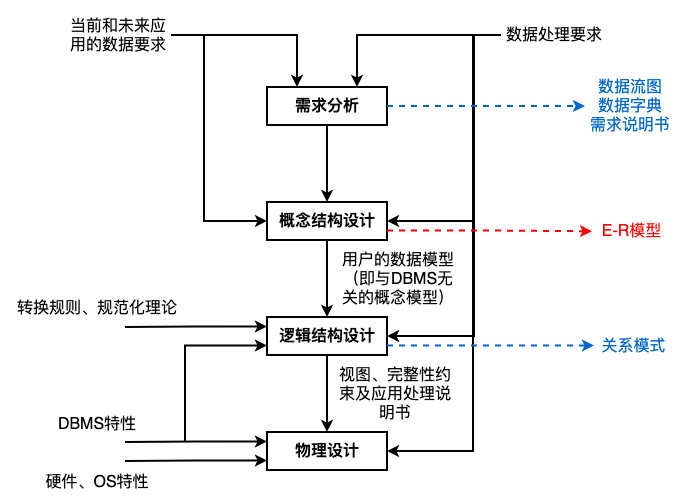

[TOC]

# 数据库技术

> 内容大纲：
>
> - 数据库基本概念
>   - 数据库系统
>   - 三级模式 —— 两级映像
>   - 数据库设计
>   - E-R模型
>   - 关系模型
>   - 关系代数
> - 规范化和并发控制
>   - 函数依赖
>   - 键与约束
>   - 范式
>   - 模式分解
>   - 并发控制
>   - 封锁协议
> - 数据库新技术
>   - 数据库安全
>   - 分布式数据库
>   - 数据仓库
>   - 反规范化技术
>   - 大数据
>   - SQL语言

## 数据库基本概念

### 数据库系统

- ==**数据**==。是数据库中存储的基本对象，是描述事务的符号记录
  - 数据的种类：文本、图形、图像、音频、视频、学生的档案记录、货物的运输情况等
- ==**数据库DB**==。是长期存储在计算机内、有组织的、可共享的大量数据的集合
- 数据库的基本特性：
  - 数据按一定的数据模型组织、描述和存储
  - 可为各种用户共享
  - 冗余度较小
  - 数据独立性较高
  - 易扩展
- ==**数据库系统DBS**==。是一个采用了数据库技术，有组织地、动态地存储大量相关数据，方便多用户访问的计算机系统。其由下面四个部分组成：
  - 数据库（统一管理、长期存储在计算机内的，有组织的相关数据的集合）
  - 硬件（构成计算机系统包括存储数据所需的外部设备）
  - 软件（操作系统、数据库管理系统及应用程序）
  - 人员（系统分析和数据库设计人员、应用程序员、最终用户、数据库管理员DBA）
- 数据库管理系统DBMS的功能：
  - 实现对共享数据有效的组织、管理和存取
  - 包括数据定义、数据库操作、数据库运行管理、数据的存储管理、数据库的建立和维护等

### 三级模式 —— 两级映像

- ==**内模式**==。管理如何存储物理的数据，对应具体物理存储文件
- ==**模式**==。又称为概念模式，就是我们通常使用的基本表，根据应用、需求将物理数据划分成一张张表
- ==**外模式**==。对应数据库中的视图这个级别，将表进行一定的处理后再提供给用户使用

- ==**外模式 —— 模式映像**==。是表和视图之间的映射，存在于概念级和外部级之间，若表中数据发生了修改，只需要修改此映射，而无需修改应用程序
- ==**模式 —— 内模式映像**==。是表和数据的物理存储之间的映射，存在于概念级和内部级之间，若修改了数据存储方式，只需要修改此映射，而不需要去修改应用程序

### 数据库设计

- ==**需求分析**==。即分析数据存储的要求，==**产出物有数据流图、数据字典、需求说明书**==
- ==**概念结构设计**==。就是==**设计E-R图**==，也即实体-联系图，与物理实现无关，说明有哪些实体，实体有哪些属性
- ==**逻辑结构设计**==。==**将E-R图，转换成关系模式**==，也即转换成实际的表和表中的列属性，这里要考虑很多规范化的东西
- ==**物理设计**==。根据生成的表等概念，==**生成物理数据库**==。

### 数据模型

#### 数据模型分类

- ==**关系模型是二维表的形式表示的实体-联系模型**==，是将实体-联系模型转换而来的，经过开发人员设计的
- ==**概念模型是从用户的角度进行建模**==的，是现实世界到信息世界的第一抽象，是真正的实体-联系模型
- 网状模型。表示实体类型及其实体之间的联系，一个事物和另外几个都有联系，形成一张网
- 面向对象模型。是采用面向对象的方法设计数据库，以对象为单位，每个对象包括属性和方法，具有类和继承等特点

#### 数据模型三要素

- ==**数据结构**==（所研究的对象类型的集合）
- ==**数据操作**==（对数据库中各种对象的实例允许执行的操作的集合）
- ==**数据的约束条件**==（一组完整性规则的集合）

#### 概念模型 —— E-R图

- 用E-R图来描述概念数据模型，世界是由一组称作实体的基本对象和这些对象之间的联系构成的

- 在E-R模型中，使用椭圆表示属性（一般存在于实例、联系上）、长方形表示实体、菱形表示联系，联系的两端要填写联系类型（实体与实体之间的对应关系），示例如下图

  

  - 实体。==**客观存在并可相互区别的事物**==。可以是具体的人、事、物或抽象概念。如，人、汽车、图书、账户、贷款
    - 弱实体和强实体。弱实体例如上图中的经理、部门经理，使用长方形加竖线的形式表示；强实体则直接使用长方形表示
    - 弱实体依赖于强实体的存在而存在
    - 实体集。具有相同类型和共享相同属性的实体的集合，如学生、课程
  - 属性。==**实体、联系所具有的特性**==
    - 属性分类：简单属性和复合属性；单值属性和多值属性；NULL属性；派生属性
    - 域。属性的取值范围称为该属性的域
    - 码（key）。唯一标识实体的属性集
  - 联系。现实世界中==**事物内部以及事务之间的联系**==，在E-R图中反映为==**实体内部的联系和实体之间的联系**==
    - 联系类型：==**一对一（1:1）、一对多（1:N）、多对多（M:N）**==

#### 关系模型

- 关系模型中，数据的逻辑结构是一张二维表，由行列组成。用表格结构表达实体集，用外键标识实体间的联系
  - 列表示属性
  - 行表示元组、记录
- 优点：建立在严格的数学概念基础上；概念单一、结构简单、清晰，用户易懂易用；存取路径对用户透明，从而数据独立性、安全性好，简化数据库开发工作
- 缺点：由于存取路径透明，查询效率往往不如非关系数据模型

#### E-R模型转为关系模型

- 每个实体都对应一个关系模型
- 实体间的联系分为三种：
  - 1:1 联系。联系可以放到任意的两端实体中，作为一个属性（要保证1:1的两端关联），也可以转换为一个单独的关系模型
  - 1:N 联系。联系可以单独作为一个关系模型，也可以在N端中加入1端实体的主键
  - M:N 联系。联系必须作为一个单独的关系模型，其主键是M端和N端的联合主键

### 关系代数

> 通过示例方式，描述关系代数
>
> - 有以下两张表
>
>   - 关系 S1
>
>   | Sno    | Sname | Sdept |
>   | ------ | ----- | ----- |
>   | No0001 | Mary  | IS    |
>   | No0003 | Candy | IS    |
>   | No0004 | Jam   | IS    |
>
>   - 关系 S2
>
>   | Sno    | Sname  | Sdept |
>   | ------ | ------ | ----- |
>   | No0001 | Mary   | IS    |
>   | No0008 | Katter | IS    |
>   | No0021 | Tom    | IS    |

- 并。结果是两张表中所有记录数合并，相同记录只显示一次

  - $S1 \cup S2$ ==> S1并S2

    | Sno    | Sname  | Sdept |
    | ------ | ------ | ----- |
    | No0001 | Mary   | IS    |
    | No0003 | Candy  | IS    |
    | No0004 | Jam    | IS    |
    | No0008 | Katter | IS    |
    | No0021 | Tom    | IS    |

- 交。结果是两张表中相同的记录

  - $S1 \cap S2$ ==> S1交S2

    | Sno    | Sname | Sdept |
    | ------ | ----- | ----- |
    | No0001 | Mary  | IS    |

- 差。结果是S1表中有，而S2表中没有的那些记录

  - $S1 - S2$ ==> S1差S2

    | Sno    | Sname | Sdept |
    | ------ | ----- | ----- |
    | No0003 | Candy | IS    |
    | No0004 | Jam   | IS    |

- 笛卡尔积。产生的结果包括S1和S2的所有属性列，并且S1中每条记录依次和S2中所有记录组合成一条记录，最终属性列为`S1 + S2`属性列，记录数为`S1 x S2`记录数

  - $S1 \times S2$

    | S1.Sno | S1.Sname | S1.Sdept | S2.Sno | S2.Sname | S2.Sdept |
    | ------ | -------- | -------- | ------ | -------- | -------- |
    | No0001 | Mary     | IS       | No0001 | Mary     | IS       |
    | No0001 | Mary     | IS       | No0008 | Katter   | IS       |
    | No0001 | Mary     | IS       | No0021 | Tom      | IS       |
    | No0003 | Candy    | IS       | No0001 | Mary     | IS       |
    | No0003 | Candy    | IS       | No0008 | Katter   | IS       |
    | No0003 | Candy    | IS       | No0021 | Tom      | IS       |
    | No0004 | Jam      | IS       | No0001 | Mary     | IS       |
    | No0004 | Jam      | IS       | No0008 | Katter   | IS       |
    | No0004 | Jam      | IS       | No0021 | Tom      | IS       |

- 投影。实际是按条件选择某关系模型中的某列，列也可以用数字表示

  - $\pi _{1,2}(S1)$ ==> 投影S1表中的第一列（Sno）和第二列（Sname）

  - 也可表示为 $\pi _{Sno, Sname}(S1)$

    | Sno    | Sname |
    | ------ | ----- |
    | No0001 | Mary  |
    | No0003 | Candy |
    | No0004 | Jam   |

- 选择。实际是按条件选择某关系模型中的某条记录

  - $\sigma _{1='No0003'}(S1)$ ==> 选择S1表中第一列等于"No0003"的记录行

  - 也可表示为 $\sigma _{Sno='No0003'}(S1)$

    | Sno    | Sname | Sdept |
    | ------ | ----- | ----- |
    | No0003 | Candy | IS    |

- **自然连接**。结果==**显示全部的属性列，但是相同的属性列只显示一次，显示两个关系模型中属性相同且值相同的记录。**==

  - 假设有关系R、S，如下图所示

    - 关系R

    | A    | B    | C    |
    | ---- | ---- | ---- |
    | a    | b    | c    |
    | b    | a    | d    |
    | c    | d    | e    |
    | d    | f    | g    |

    - 关系S

    | A    | C    | D    |
    | ---- | ---- | ---- |
    | a    | c    | d    |
    | d    | f    | g    |
    | b    | d    | g    |

  - 自然连接的结果如下

    - $R \Join S$ ==> R、S自然连接
    - 这里A、C两列是两个关系模型中相同的列，因此，我们需要对这两列的值进行比较，其中只有a、c , b、d 这两行的记录是相同的

    | A    | B    | C    | D    |
    | ---- | ---- | ---- | ---- |
    | a    | b    | c    | d    |
    | b    | a    | d    | g    |